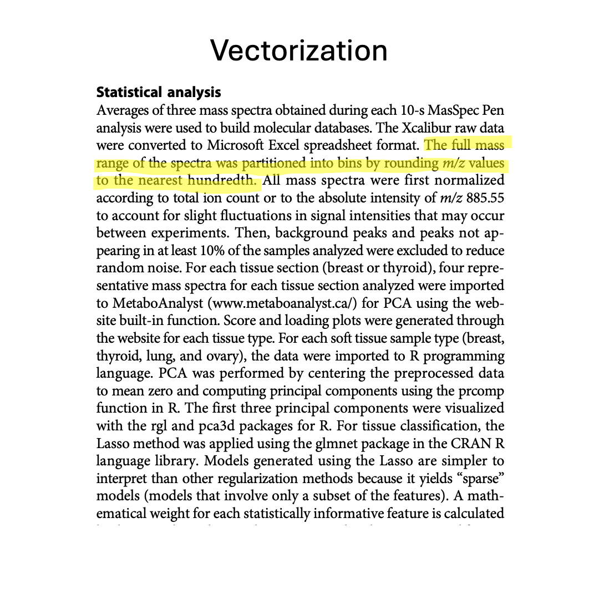
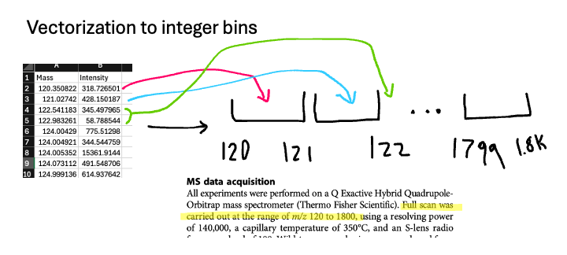
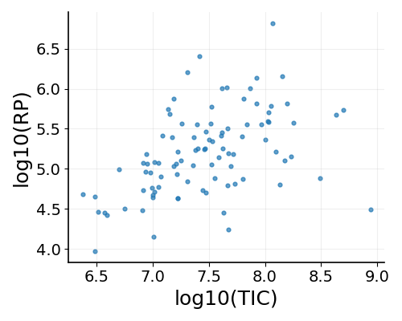
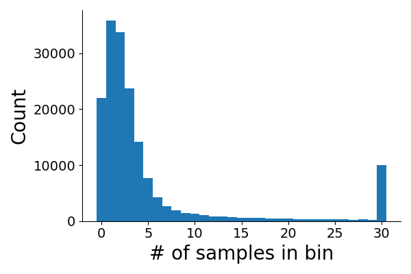
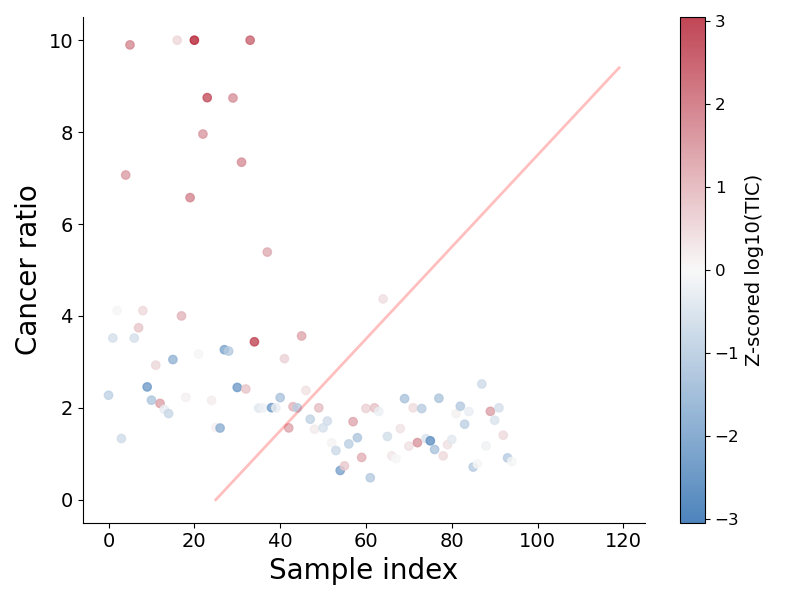
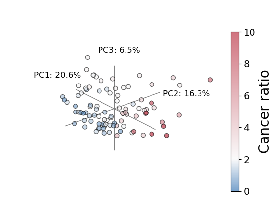

## Mass spec modelling 

The purpose of this notebook is to help Burt Lab members understand how to translate the [MS pen](https://doi.org/10.1126/scitranslmed.aan3968) workflow into code. It attempts to faithfully recreate the workflow steps for the [lung cancer data set](https://dataverse.harvard.edu/dataset.xhtml?persistentId=doi:10.7910/DVN/XBVHGM). 

There are four steps:
1. Vectorization: mapping spectra peaks to bins
2. Normalization: mapping to common scale 
3. Filtering: removing noisy peaks 
4. Centering: mapping to standard scale 



*Workflow for MS Pen analysis highlighted by stage.*

```python
import numpy as np
import pandas as pd
from glob import glob
import json

import matplotlib.pyplot as plt
from mpl_toolkits.mplot3d import Axes3D 
from matplotlib.colors import LinearSegmentedColormap, Normalize
from matplotlib.colors import TwoSlopeNorm

from sklearn.preprocessing import StandardScaler
from sklearn.decomposition import PCA
from sklearn.linear_model import LogisticRegression
from sklearn.model_selection import LeaveOneOut, cross_val_predict
from sklearn.pipeline import Pipeline
from sklearn.metrics import accuracy_score, precision_score, recall_score, f1_score
```

```python
# grabbing the filenames 
filenames = np.array(glob("data/lung_mspen/Lung*.csv"))
filenames = filenames[np.argsort([int(x.split("Lung")[1].split(".")[0]) for x in filenames])]
```

## Vectorization
With vectorization, sometimes the reference peaks are off by one bin due to how we assign bins whether it is: 
1. Nearest range: `np.round((mz - mz_min) / bin_size).astype(int)`
2. Exact range: `np.digitize(mz, main_edges, right=False) - 1`.

For example with integer bins, 120.9 would map to bin 121-122 in the nearest approach and 120-121 in the exact approach. 

These are both examples of hard binning where we assign all of the intensity to one window bin. While the nearest approach yields more samples with the correct bin, there are still some that are off by one. This is less of a problem with larger bins (like integer ranges), but it can be resolved by taking a moving average of adjacent bins. The tradeoff is some peaks become blurred. 

Centroiding is useful for tracking what spectra map to particular bins but does not resolve the issue of signal being slightly off. 


*Nearest versus exact alignment around 885.55 m/z window.*

```python
def vectorize_spectrum(
    df,
    bin_size=1.0,
    mz_min=120,
    mz_max=1800
):
    """
    Convert a single mass spectrum (m/z, intensity) into a fixed-length
    binned vector.

    Parameters
    ----------
    df : pandas.DataFrame
        Mass spectrum with (m/z, intensity).
    bin_size : float
        Size of each m/z bin.
    mz_min : float
        Start of first bin (inclusive).
    mz_max: float
        End of last bin (exclusive).

    Returns
    -------
    binned : numpy.ndarray
        Vectorized counts.
    centroids : numpy.ndarray
        Intensity-weighted m/z centroid per bin.
    bin_edges : numpy.ndarray
        Edges of vector bins. 
        
    """

    # data columns 
    mz_col="Mass"
    intensity_col="Intensity"

    # remove NaNs 
    df = df[[mz_col, intensity_col]].dropna()

    mz = df[mz_col].values
    intensity = df[intensity_col].values

    # bins defined 
    bin_edges = np.arange(mz_min, mz_max, bin_size)
    
    # map which bin each m/z value falls in shifted to 0-index 
    # map to exact bin 
    bin_indices = np.digitize(mz, bin_edges, right=False) - 1
    # rounding to nearest bin (alternative approach)  
    # bin_indices = np.round((mz - mz_min) / bin_size).astype(int)
    
    n_bins = len(bin_edges) 
    
    # sum intensities of each row into correct bin based on index 
    binned = np.bincount(bin_indices, weights=intensity, minlength=n_bins)
    # sum intensities * spectra of each row into correct bin based on index
    weighted_mz_sum = np.bincount(bin_indices, weights=mz * intensity, minlength=n_bins)
    
    # ignores div by zero 
    with np.errstate(divide='ignore', invalid='ignore'):
        # sample centroid calculation 
        # 120.9 + 120.1 with intensity values 1 and 2 respectively would shift the centroid towards 120.1 
        centroids = weighted_mz_sum / binned
        centroids[binned == 0] = np.nan

    return binned, centroids, bin_edges
```


When we read in one file, we can look at the intensity, the centroid, and the starting bin edge (the reason the bin range is not exactly 885.55 is because of floating point error where that number is unable to be represented precisely, but it can be ignored).  


```python
idx_885 = int((885.55-120)*100)

# vectorize_spectrum returns intensity (a), centroids (b), bin edges (c)
a,b,c = vectorize_spectrum(pd.read_csv(filenames[0]),bin_size=0.01,mz_min=120.0, mz_max=1800.0)
print(a[idx_885],b[idx_885],c[idx_885])
```

    80552.699544 885.554346 885.5500000003916


```python
binned_counts = []

# read mass spectrum data and vectorize but only hold on to bin values and turn into a matrix 
for f in filenames: 
    lung_df = pd.read_csv(f)
    bins,_,_ = vectorize_spectrum(lung_df,bin_size=0.01,mz_min=120.0, mz_max=1800.0)
    binned_counts += [bins]

X = np.array(binned_counts)
```



*Vectorization process for integer counts.*


## Normalization
There are two ways to consider normalization:
1. Total ion current (TIC) normalization, divide by total intensity
2. Reference peak (RP) normalization, divide by 885.55 m/z

We opted for TIC normalization to start because it was unclear at the time whether the RP denominator would be consistent. We can observe a moderate positive correlation between denominator log-scales, hence, either choice is probably fine. The benefit of RP normalization might be that if you have some outlier peak with high intensity that distorts the rest of the sample and will be subsequently removed, then by normalizing by RP, you keep a consistent standard. 


```python
# every row is a sample in the matrix, so we just sum them to get TIC
total_ion = X.sum(1)
# here we're just doing +/- 2 bins around 885.55 
ref_ion = X[:, ((np.array([885.53, 885.54, 885.55, 885.56, 885.57]) - 120) * 100).astype(int)].sum(1)
```


```python
# TIC normalization 
X_tic = (X.T/total_ion).T
# RP normalization 
X_rp = (X.T/ref_ion).T
```


```python
eps = 1e-3

plt.figure(figsize=(5, 4))
plt.scatter(np.log10(total_ion + eps), np.log10(ref_ion + eps),
            s=12, alpha=0.7)

plt.xlabel("log10(TIC)", fontsize=18)
plt.ylabel("log10(RP)", fontsize=18)

plt.xticks(fontsize=14)
plt.yticks(fontsize=14)

ax = plt.gca()
ax.spines['top'].set_visible(False)
ax.spines['right'].set_visible(False)

ax.spines['left'].set_linewidth(1.2)
ax.spines['bottom'].set_linewidth(1.2)

plt.grid(alpha=0.2)
plt.tight_layout()
plt.savefig("plots/notebook/tic_vs_rp.png")
plt.close()
plt.clf()
```



*Sample total-ion-count vs relative peak (885.55 m/z).*


## Pooling 
Before we filter any peaks, we consider pooling adjacent bins. You can do this before or after normalization because it should affect every window the same. From the paper, it's not clear how they merged adjacents bins to get a clean 885.55 signal. The motivation here is just to have consistent features identified as explanatory. 


```python
# moving window, summing adjacent bins +/- 
X_smooth_tic = np.apply_along_axis(lambda x : np.convolve(x, np.ones(3), mode="same"), 1, X_tic)
X_smooth_rp = np.apply_along_axis(lambda x : np.convolve(x, np.ones(3), mode="same"), 1, X_rp)
```

## Filtering 
There are two types of filtering we do: 
1. Removing outlier peaks (lower and upper bound)
2. Removing rare peaks only observed in at most a few samples (10%)

Removing outlier peaks by quantile is not standard for mass spec; typically background correction is derived from calibrated water peaks where the frequency spectra for water (m/z < 120) is excluded. 

We found that upper bound filtering helps separate the first half of the data from the second with our cancer ratio score, but this may be because of batch effects rather than adding information. This is not the standard step. 


```python
def baseline_and_ceiling(row, low_q=0.01, high_q=0.99):
    """
    Lower and upper bound clipping of array based on non-zero elements.

    row : numpy.ndarray
        Array to be clipped.
    low_q : float
        Lower bound.
    high_q : float
        Upper bound.

    Returns
    -------
    out : numpy.ndarray
        Clipped, baseline subtracted intensities.
        
    """
    
    # drop zeros 
    nz = row[row > 0]
    if nz.size == 0:
        return row

    # bounds 
    p_lo  = np.quantile(nz, low_q)
    p_hi = np.quantile(nz, high_q)

    # subtract lower bound 
    out = row - p_lo
    out[out < 0] = 0
    
    # clip upper bound 
    out[out > p_hi] = p_hi
    
    return out
```


```python
# Eberlin group confirmed that they used TIC for lung data set 
X_bg = np.apply_along_axis(baseline_and_ceiling, 1, X_smooth_tic, low_q=0.01, high_q=0.99)
```


```python
# find the bins that are in more than 10% of samples and subset to just those 
feature_count = (X_bg>0).sum(0)

# 10/96 > 10%
X_fc = X_bg[:,(feature_count>9)]
```

Most bins do not have many samples, and so we are throwing these out. We go from 168,000 to 20,000 bins after filtering, and around 10,000 of these bins have around 30 samples.


```python
# pre-filtering, post-filtering
X_tic.shape, X_fc.shape
```

    ((95, 168000), (95, 20562))


```python
fig, ax = plt.subplots(figsize=(6, 4))

vals = (X_bg > 0).sum(0)

# clip all values above 30 into last bin 
vals_clipped = np.minimum(vals, 30)
bins = np.arange(-0.5, 30 + 1.5, 1)


ax.hist(vals_clipped, bins=bins)

ax.tick_params(axis="both", labelsize=14)

ax.spines["top"].set_visible(False)
ax.spines["right"].set_visible(False)

ax.set_xlabel("# of samples in bin", fontsize=20)
ax.set_ylabel("Count", fontsize=20)

plt.tight_layout()

plt.savefig("plots/notebook/bg_filter.png")
plt.close()
plt.clf()
```



*# samples per bin, truncated at 30 (there are 95 samples).*


## Cancer ratio 
We take the peaks identified from the paper and calculate a simple ratio clipped at 10. The first half of the samples have higher cancer scores, but with the current set of pipeline steps, it is more mixed than previously observed. 


```python
# since we have pooled adjacents bins, using exact indices should not miss any values now
# the starting bin is 120.00-120.01, hence we subtract 120
# bins are at the hundredths, hence we multiply by 100
cancer_idx = ((np.array([773.54, 747.51, 863.56, 281.25])-120)*100).astype(int)
normal_idx = ((np.array([885.55, 744.55])-120)*100).astype(int)
```


```python
count_score=X_bg[:,cancer_idx].sum(1)/X_bg[:,normal_idx].sum(1)
count_score[count_score>10]=10
```


```python
idx = np.arange(len(count_score))

# total counts per spectrum
tic = X.sum(1)

# log10 + z-score TIC
eps = 1e-3
log_tic = np.log10(tic + eps)
z_tic = (log_tic - log_tic.mean()) / log_tic.std()

fig, ax = plt.subplots(figsize=(8, 6))

x_line = np.array([idx.min(), idx.max()])
y_line = x_line * 0.1
ax.plot(x_line + 25, y_line, color="red", linewidth=2, alpha=0.25)

# blue, white, red custom cmap 
colors = ["#2166ac", "#f7f7f7", "#b2182b"] 
cmap = LinearSegmentedColormap.from_list("blue_white_red_skewed", colors)

# clipped standard scale for Z-scores 
norm = Normalize(vmin=-3.05, vmax=3.05)

sc = ax.scatter(
    idx,
    count_score,
    c=z_tic,
    cmap=cmap,
    norm=norm,
    alpha=0.8,
)

ax.set_xlabel("Sample index", fontsize=20)
ax.set_ylabel("Cancer ratio", fontsize=20)
ax.tick_params(axis="both", labelsize=14)
ax.spines["top"].set_visible(False)
ax.spines["right"].set_visible(False)

cbar = plt.colorbar(sc, ax=ax)
cbar.set_label("Z-scored log10(TIC)", fontsize=14)
cbar.ax.tick_params(labelsize=12)

plt.tight_layout()

plt.savefig("plots/notebook/cancer_ratio_tic.png")
plt.close()
plt.clf()
```



*Cancer ratio, colored by total-ion-count, ordered by sample index.*


## Centering 
There is some debate about whether to scale variance to 1, but currently our workflow is to keep variance as it is for PCA but then center it for modelling, so that all features are treated the same. 

We know that some peaks are highly variable and strongly discriminate between cancer and healthy samples, but when modelling this variability, these features can dominate the objective function and overshadow the contributions of other informative peaks if not normalized. 


```python
scaler = StandardScaler(with_mean=True, with_std=False)
X_scaled = scaler.fit_transform(np.log1p(X_fc))
```


```python
pca = PCA(n_components=20)
scores = pca.fit_transform(X_scaled)
loadings = pca.components_
variance = pca.explained_variance_ratio_
```


```python
# cancer ratio scaled from 0 to 10 
norm = Normalize(vmin=0, vmax=10)

# setting cancer ratio cmap as cancer for values above 2 and normal for below 2 
colors = [
    (0.0,  "#2166ac"),  # dark-ish blue at 0
    (0.2,  "#f7f7f7"),  # white at value 2
    (1.0,  "#b2182b"),  # dark red at value 10
]
cmap = LinearSegmentedColormap.from_list("bwr_skew", colors)

pc1 = scores[:, 0]
pc2 = scores[:, 1]
pc3 = scores[:, 2]

fig = plt.figure(figsize=(7, 6))
ax = fig.add_subplot(111, projection="3d")

sc = ax.scatter(
    pc1, pc2, pc3,
    c=count_score,
    norm=norm,
    cmap=cmap,
    s=40,
    alpha=0.6,
    edgecolors="black"
)

# turn off panes and grid
ax.xaxis.pane.set_visible(False)
ax.yaxis.pane.set_visible(False)
ax.zaxis.pane.set_visible(False)
ax.grid(False)

# remove tick labels (or keep if you want them)
ax.set_xticks([])
ax.set_yticks([])
ax.set_zticks([])

# light background
fig.patch.set_facecolor("white")
ax.set_facecolor("white")

# draw PC1, PC2, PC3 axes as grey lines through origin
# line length
L = max(np.max(np.abs(pc1)), np.max(np.abs(pc2)), np.max(np.abs(pc3))) / 1.5
axis_len = L * 0.9

ax.plot([-axis_len, axis_len], [0, 0], [0, 0], color="grey", lw=1)
ax.plot([0, 0], [-axis_len, axis_len], [0, 0], color="grey", lw=1)
ax.plot([0, 0], [0, 0], [-axis_len, axis_len], color="grey", lw=1)

cbar = fig.colorbar(sc, ax=ax, shrink=0.7)
cbar.set_label("Cancer ratio", fontsize=20)
cbar.set_ticks([0, 2, 4, 6, 8, 10]) 
cbar.ax.tick_params(labelsize=14)
ax.set_axis_off()

ax.set_xlim(-L, L)
ax.set_ylim(-L, L)
ax.set_zlim(-L, L)

# axis label are finicky 
ax.text(-axis_len*1.5, -axis_len*0.5, axis_len*0.25, f"PC1: {variance[0] * 100:.1f}%", color="black",fontsize=12)
ax.text(0, axis_len*1.0625, -axis_len/8, f"PC2: {variance[1] * 100:.1f}%", color="black",fontsize=12)
ax.text(-axis_len*0.25, -axis_len*0.125, axis_len*1.25, f"PC3: {variance[2] * 100:.1f}%", color="black",fontsize=12)

# rotate plot 
ax.view_init(elev=25, azim=-40)

plt.savefig("plots/notebook/pca.png", bbox_inches="tight")
plt.clf()
plt.close()
```



*PCA colored by cancer ratio score.*


## Classification
We do not know which sample spectra are from cancer, but given that the processed cancer scores skew towards the first half of the data set, we can take a guess that these are the cancer patients. To test against this, we can consider randomly shuffling what we consider as cancer and modelling random labels as well.


```python
# number of spectra 
n = X_bg.shape[0]   
y = np.zeros(n, dtype=int)
# our guess of the where the 48 cancer patients are in the order (first half)
y[:48] = 1 

# random shuffling of cancer labels in 10 baseline data sets
yp = {i:np.random.permutation(y) for i in range(10)}
```


```python
# modelling pipeline involves standardized scaling for mean and variance and logistic lasso regression 
pipe = Pipeline([
    ("scaler", StandardScaler(with_mean=True, with_std=True)),
    ("clf", LogisticRegression(     
        penalty="l1", # L1 is Lasso flavored 
        solver="liblinear",
        max_iter=5000,
    ))
])

cv = LeaveOneOut()

# LOOCV
y_pred = cross_val_predict(pipe, np.log1p(X_fc), y, cv=cv)

# Now compute metrics ONCE on the full set
acc   = accuracy_score(y, y_pred)
prec  = precision_score(y, y_pred)        #
rec   = recall_score(y, y_pred)
f1    = f1_score(y, y_pred)

print("Accuracy:", acc)
print("Precision:", prec)
print("Recall:", rec)
print("F1:", f1)
```

    Accuracy: 0.8947368421052632
    Precision: 0.88
    Recall: 0.9166666666666666
    F1: 0.8979591836734694


```python
for i in range(10):
    # modelling pipeline involves standardized scaling for mean and variance and logistic lasso regression 
    pipe = Pipeline([
        ("scaler", StandardScaler(with_mean=True, with_std=True)),
        ("clf", LogisticRegression(
            penalty="l1",
            solver="liblinear",
            max_iter=5000,
        ))
    ])
    
    cv = LeaveOneOut()
    
    y_pred = cross_val_predict(pipe, np.log1p(X_fc), yp[i], cv=cv)
    
    acc   = accuracy_score(yp[i], y_pred)
    prec  = precision_score(yp[i], y_pred)        
    rec   = recall_score(yp[i], y_pred)
    f1    = f1_score(yp[i], y_pred)

    print(f"Permutation #{i+1}")
    print("Accuracy:", acc)
    print("Precision:", prec)
    print("Recall:", rec)
    print("F1:", f1)
    print("\n")
```

    Permutation #1
    Accuracy: 0.5157894736842106
    Precision: 0.5208333333333334
    Recall: 0.5208333333333334
    F1: 0.5208333333333334
    
    
    Permutation #2
    Accuracy: 0.5473684210526316
    Precision: 0.5531914893617021
    Recall: 0.5416666666666666
    F1: 0.5473684210526316
    
    
    Permutation #3
    Accuracy: 0.6842105263157895
    Precision: 0.6551724137931034
    Recall: 0.7916666666666666
    F1: 0.7169811320754716
    
    
    Permutation #4
    Accuracy: 0.5052631578947369
    Precision: 0.5111111111111111
    Recall: 0.4791666666666667
    F1: 0.4946236559139785
    
    
    Permutation #5
    Accuracy: 0.45263157894736844
    Precision: 0.4523809523809524
    Recall: 0.3958333333333333
    F1: 0.4222222222222222
    
    
    Permutation #6
    Accuracy: 0.5263157894736842
    Precision: 0.5319148936170213
    Recall: 0.5208333333333334
    F1: 0.5263157894736842
    
    
    Permutation #7
    Accuracy: 0.5263157894736842
    Precision: 0.5384615384615384
    Recall: 0.4375
    F1: 0.4827586206896552
    
    
    Permutation #8
    Accuracy: 0.5052631578947369
    Precision: 0.5121951219512195
    Recall: 0.4375
    F1: 0.47191011235955055
    
    
    Permutation #9
    Accuracy: 0.3894736842105263
    Precision: 0.3958333333333333
    Recall: 0.3958333333333333
    F1: 0.3958333333333333
    
    
    Permutation #10
    Accuracy: 0.5263157894736842
    Precision: 0.5294117647058824
    Recall: 0.5625
    F1: 0.5454545454545454
    
    


## Feature importance
We can observe that the random permutations do not perform that well relative to our initial guess of where the cancer patients are located. Note, we could still be modelling something else that happens to be separable, but it is likely that the cancer patients cluster to the first half. Our first guess is reasonable. We can also estimate which features are most important based on a model trained using all of the data. 

773.54 and 744.55 have near peaks but they are not exact. We can see the smoothing feature in action. Note that using the unsmoothed data will return some related features, but they may be missing 


```python
pipe.fit(np.log1p(X_fc), y)
clf = pipe.named_steps["clf"]
coef = clf.coef_.ravel()
```


```python
pos_order = np.argsort(coef)[::-1]
neg_order = np.argsort(coef)
```


```python
# 773.54, 747.51, 863.56, 281.25
top20_idx = pos_order[:20]
np.arange(X.shape[1])[(feature_count>9)][top20_idx]/100+120
```


    array([745.49, 774.53, 533.28, 775.54, 783.48, 341.17, 855.44, 341.16,
           776.53, 339.17, 721.5 , 745.5 , 774.54, 647.47, 413.16, 775.55,
           699.39, 520.32, 473.31, 327.15])


```python
# 885.55, 744.55
bot20_idx = neg_order[:20]
np.arange(X.shape[1])[(feature_count>9)][bot20_idx]/100+120
```


    array([187.04, 433.32, 187.03, 221.02, 780.54, 275.05, 218.1 , 218.09,
           698.51, 240.03, 221.01, 186.03, 240.04, 700.52, 642.3 , 275.04,
           887.56, 600.24, 780.56, 700.53])


## Interactive spectra viewer

Use the dropdown to switch between a few example spectra and hover to see the exact m/z and intensity values. Technically data are behind a protected wall, so we only show four samples. 

<div class="spec-container">
<div class="spec-sidebar">
<div class="control-group">
<label for="spec-select">Spectrum</label>
<select id="spec-select"></select>
</div>
<div class="control-group">
<label>Markers</label>
<button id="btn-cancer" class="marker-btn" style="border: 1px solid #f87171; color: #f87171;">Cancer</button>
<button id="btn-normal" class="marker-btn" style="border: 1px solid #15aafaff; color: #15aafaff;">Normal</button>
</div>
<div class="control-group">
<label>Zoom Axis</label>
<div style="display: flex; gap: 0.5rem;">
<button id="btn-zoom-x" class="marker-btn" style="border: 1px solid #10b981; color: white; background-color: #10b981;">X-Axis</button>
<button id="btn-zoom-y" class="marker-btn" style="border: 1px solid #d1d5db; color: #374151; background-color: white;">Y-Axis</button>
</div>
</div>
<div class="control-group" style="margin-top: auto;">
<button id="btn-reset" class="marker-btn" style="border: 1px solid #9ca3af; color: #374151; background: #e5e7eb;">Reset View</button>
</div>
</div>
<div class="spec-main">
<svg id="spec-chart"></svg>
<div id="spec-tooltip" class="spec-tooltip"></div>
</div>
</div>

<script>
  (function() {
    const svgElement = document.getElementById('spec-chart');
    if (!svgElement || !window.d3) return;

    const svg = d3.select(svgElement);
    svg.selectAll("*").remove();

    // Responsive dimensions
    // We need to account for the sidebar width now
    const containerWidth = svgElement.parentElement.clientWidth;
    const height = 400; 
    const width = containerWidth; 
    
    svg.attr("width", "100%").attr("height", height);
    // Use viewBox for better responsiveness in the flex layout
    svg.attr("viewBox", `0 0 ${width} ${height}`);

    const margin = {top: 20, right: 20, bottom: 50, left: 80}; // Increased left margin
    const innerWidth  = width  - margin.left - margin.right;
    const innerHeight = height - margin.top  - margin.bottom;

    // Clip path
    svg.append("defs").append("clipPath")
       .attr("id", "clip")
       .append("rect")
       .attr("width", innerWidth)
       .attr("height", innerHeight);

    const g = svg.append("g")
      .attr("transform", `translate(${margin.left},${margin.top})`);

    const tooltip = d3.select("#spec-tooltip");
    const select  = d3.select("#spec-select");
    const btnCancer = d3.select("#btn-cancer");
    const btnNormal = d3.select("#btn-normal");
    const btnReset  = d3.select("#btn-reset");
    const btnZoomX  = d3.select("#btn-zoom-x");
    const btnZoomY  = d3.select("#btn-zoom-y");

    // Scales
    const xScale = d3.scaleLinear().range([0, innerWidth]);
    const yScale = d3.scaleLinear().range([innerHeight, 0]);

    // Axes
    const xAxisGroup = g.append("g").attr("transform", `translate(0,${innerHeight})`);
    const yAxisGroup = g.append("g");

    // Labels
    svg.append("text")
      .attr("x", margin.left + innerWidth / 2)
      .attr("y", margin.top + innerHeight + 40)
      .attr("text-anchor", "middle")
      .attr("fill", "#000")
      .style("font-weight", "bold")
      .text("m/z");

    svg.append("text")
      .attr("transform", "rotate(-90)")
      .attr("x", -(margin.top + innerHeight/2))
      .attr("y", 25) // Adjusted y position
      .attr("text-anchor", "middle")
      .attr("fill", "#000")
      .style("font-weight", "bold")
      .text("Intensity");

    // Zoom
    let zoomMode = 'x'; // 'x' or 'y'
    let transformX = d3.zoomIdentity;
    let transformY = d3.zoomIdentity;

    const zoom = d3.zoom()
      .scaleExtent([1, 50])
      .translateExtent([[0, 0], [innerWidth, innerHeight]])
      .extent([[0, 0], [innerWidth, innerHeight]])
      .on("zoom", zoomed);

    svg.call(zoom)
       .on("dblclick.zoom", null);

    // Groups
    const contentGroup = g.append("g").attr("clip-path", "url(#clip)");
    const markerGroup = g.append("g").attr("clip-path", "url(#clip)");

    let currentData = [];
    let showCancer = false;
    let showNormal = false;

    const cancerMarkers = [863, 773, 747, 281];
    const normalMarkers = [855, 744];

    // Button Logic
    btnCancer.on("click", () => {
      showCancer = !showCancer;
      btnCancer.style("background-color", showCancer ? "rgba(248, 113, 113, 0.2)" : "transparent");
      updateMarkers();
    });

    btnNormal.on("click", () => {
      showNormal = !showNormal;
      btnNormal.style("background-color", showNormal ? "rgba(21, 143, 250, 0.2)" : "transparent");
      updateMarkers();
    });

    btnReset.on("click", () => {
      transformX = d3.zoomIdentity;
      transformY = d3.zoomIdentity;
      svg.transition().duration(750).call(zoom.transform, d3.zoomIdentity);
    });

    btnZoomX.on("click", () => {
      if (zoomMode === 'x') return;
      zoomMode = 'x';
      
      // Update UI
      btnZoomX.style("background-color", "#10b981").style("color", "white").style("border-color", "#10b981");
      btnZoomY.style("background-color", "white").style("color", "#374151").style("border-color", "#d1d5db");
      
      // Switch zoom transform to X state
      svg.call(zoom.transform, transformX);
    });

    btnZoomY.on("click", () => {
      if (zoomMode === 'y') return;
      zoomMode = 'y';
      
      // Update UI
      btnZoomY.style("background-color", "#10b981").style("color", "white").style("border-color", "#10b981");
      btnZoomX.style("background-color", "white").style("color", "#374151").style("border-color", "#d1d5db");
      
      // Switch zoom transform to Y state
      svg.call(zoom.transform, transformY);
    });

    const dataUrl = "/data/spectra_demo.json";

    d3.json(dataUrl).then(spectra => {
      const filenames = Object.keys(spectra);
      if (!filenames.length) return;

      select.selectAll("option").remove();
      select.selectAll("option")
        .data(filenames)
        .enter()
        .append("option")
        .attr("value", d => d)
        .text(d => d);

      select.on("change", function() { renderSpectrum(this.value); });

      renderSpectrum(filenames[0]);

      function renderSpectrum(fname) {
        const spec = spectra[fname];
        const mz   = spec.mz;
        const I    = spec.intensity;

        const mzMin = d3.min(mz);
        const mzMax = d3.max(mz);

        xScale.domain([mzMin, mzMax]);
        yScale.domain([0, d3.max(I) * 1.1]);

        currentData = mz.map((m, i) => ({mz: m, intensity: I[i]}));

        updateChart(currentData);
        updateMarkers();
        
        // Reset zoom state
        transformX = d3.zoomIdentity;
        transformY = d3.zoomIdentity;
        svg.call(zoom.transform, d3.zoomIdentity);
      }
    });

    function updateChart(data) {
      const bars = contentGroup.selectAll(".bar").data(data);
      bars.enter()
        .append("rect")
        .attr("class", "bar")
        .merge(bars)
        .attr("x", d => xScale(d.mz))
        .attr("y", d => yScale(d.intensity))
        .attr("width", 2)
        .attr("height", d => innerHeight - yScale(d.intensity))
        .attr("fill", "#059669")
        .attr("opacity", 0.5);
      bars.exit().remove();

      xAxisGroup.call(d3.axisBottom(xScale));
      yAxisGroup.call(d3.axisLeft(yScale));
      
      xAxisGroup.selectAll("text").attr("fill", "black");
      xAxisGroup.selectAll("line").attr("stroke", "black");
      xAxisGroup.selectAll("path").attr("stroke", "black");
      
      yAxisGroup.selectAll("text").attr("fill", "black");
      yAxisGroup.selectAll("line").attr("stroke", "black");
      yAxisGroup.selectAll("path").attr("stroke", "black");
    }

    function updateMarkers() {
      let markers = [];
      if (showCancer) markers = markers.concat(cancerMarkers.map(m => ({mz: m, type: 'cancer'})));
      if (showNormal) markers = markers.concat(normalMarkers.map(m => ({mz: m, type: 'normal'})));

      const tX = transformX;
      const newXScale = tX.rescaleX(xScale);

      const rects = markerGroup.selectAll(".marker-rect").data(markers, d => d.mz + d.type);

      rects.enter()
        .append("rect")
        .attr("class", "marker-rect")
        .merge(rects)
        .attr("x", d => newXScale(d.mz - 1.5))
        .attr("y", 0)
        .attr("width", d => newXScale(d.mz + 1.5) - newXScale(d.mz - 1.5))
        .attr("height", innerHeight)
        .attr("fill", d => d.type === 'cancer' ? "#ef4444" : "#15aafaff")
        .attr("opacity", 0.5);

      rects.exit().remove();
    }

    function zoomed(event) {
      // Update the transform for the current mode
      if (zoomMode === 'x') {
        transformX = event.transform;
      } else {
        transformY = event.transform;
      }

      // Calculate new scales based on their respective transforms
      const newXScale = transformX.rescaleX(xScale);
      const newYScale = transformY.rescaleY(yScale);

      // Update axes
      xAxisGroup.call(d3.axisBottom(newXScale));
      yAxisGroup.call(d3.axisLeft(newYScale));
      
      // Style axes
      xAxisGroup.selectAll("text").attr("fill", "black");
      xAxisGroup.selectAll("line").attr("stroke", "black");
      xAxisGroup.selectAll("path").attr("stroke", "black");
      
      yAxisGroup.selectAll("text").attr("fill", "black");
      yAxisGroup.selectAll("line").attr("stroke", "black");
      yAxisGroup.selectAll("path").attr("stroke", "black");

      // Update bars
      contentGroup.selectAll(".bar")
        .attr("x", d => newXScale(d.mz))
        .attr("width", 2)
        .attr("y", d => newYScale(d.intensity))
        .attr("height", d => innerHeight - newYScale(d.intensity));

      // Update markers
      markerGroup.selectAll(".marker-rect")
        .attr("x", d => newXScale(d.mz - 1.5))
        .attr("width", d => newXScale(d.mz + 1.5) - newXScale(d.mz - 1.5))
        .attr("height", innerHeight); // Markers always span full height
    }

    svg.on("mousemove", function(event) {
      if (!currentData.length) return;
      
      const [mx, my] = d3.pointer(event, g.node());
      
      if (mx < 0 || mx > innerWidth || my < 0 || my > innerHeight) {
        tooltip.style("opacity", 0);
        contentGroup.selectAll(".bar").attr("fill", "#059669");
        return;
      }

      // Use stored transforms instead of current zoom state which might be for the other axis
      const newXScale = transformX.rescaleX(xScale);
      const mzVal = newXScale.invert(mx);
      const bisect = d3.bisector(d => d.mz).center;
      const idx = bisect(currentData, mzVal);
      
      if (idx >= 0 && idx < currentData.length) {
        const d = currentData[idx];
        // Calculate position relative to the container (.spec-main)
        const [containerX, containerY] = d3.pointer(event, svgElement.parentElement);
        
        tooltip
          .style("opacity", 1)
          .style("left", (containerX + 15) + "px")
          .style("top",  (containerY - 15) + "px")
          .html(`<strong>m/z:</strong> ${d.mz.toFixed(2)}<br><strong>Int:</strong> ${d.intensity.toFixed(1)}`);
        contentGroup.selectAll(".bar").attr("fill", b => b === d ? "#facc15" : "#059669");
      }
    })
    .on("mouseout", () => {
      tooltip.style("opacity", 0);
      contentGroup.selectAll(".bar").attr("fill", "#059669");
    });

  })();
</script>

<style>
  .spec-container {
    display: flex;
    flex-direction: column;
    background-color: #f9fafb; /* Off-white */
    border-radius: 12px;
    box-shadow: 0 4px 6px -1px rgba(0, 0, 0, 0.1);
    overflow: hidden;
    margin-top: 1rem;
  }

  @media (min-width: 768px) {
    .spec-container {
      flex-direction: row;
    }
  }

  .spec-sidebar {
    padding: 1.5rem;
    background-color: #f3f4f6; /* Slightly darker off-white for sidebar */
    border-right: 1px solid #e5e7eb;
    display: flex;
    flex-direction: column;
    gap: 1.5rem;
    min-width: 200px;
  }

  .spec-main {
    flex-grow: 1;
    position: relative;
    background-color: #f9fafb;
  }

  .control-group {
    display: flex;
    flex-direction: column;
    gap: 0.5rem;
  }

  .control-group label {
    font-size: 0.85rem;
    font-weight: 600;
    color: #374151;
    text-transform: uppercase;
    letter-spacing: 0.05em;
  }

  #spec-select {
    width: 100%;
    padding: 0.5rem;
    border: 1px solid #d1d5db;
    border-radius: 6px;
    background-color: white;
    color: #111827;
    font-size: 0.95rem;
  }

  .marker-btn {
    width: 100%;
    padding: 0.5rem;
    border-radius: 6px;
    cursor: pointer;
    font-size: 0.9rem;
    font-weight: 600;
    transition: all 0.2s;
    text-align: center;
    background-color: white;
  }

  .marker-btn:hover {
    filter: brightness(0.95);
  }

  .spec-tooltip {
    position: absolute;
    padding: 6px 10px;
    font-size: 13px;
    background: rgba(0,0,0,0.85);
    color: #fff;
    border-radius: 4px;
    pointer-events: none;
    opacity: 0;
    transition: opacity 0.1s;
    z-index: 999;
    box-shadow: 0 2px 4px rgba(0,0,0,0.2);
  }

  .bar {
    cursor: crosshair;
  }
</style>