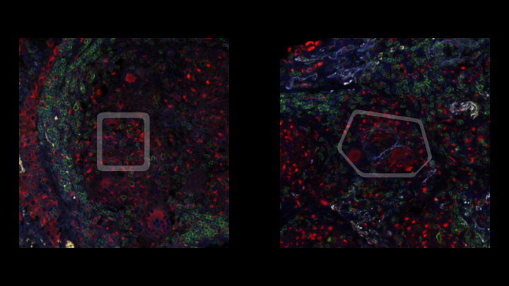
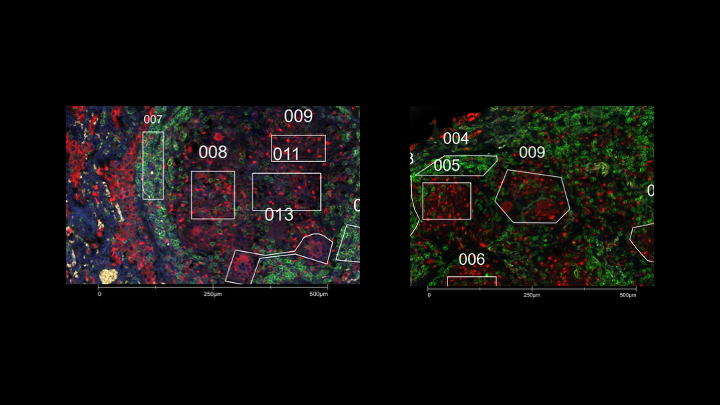
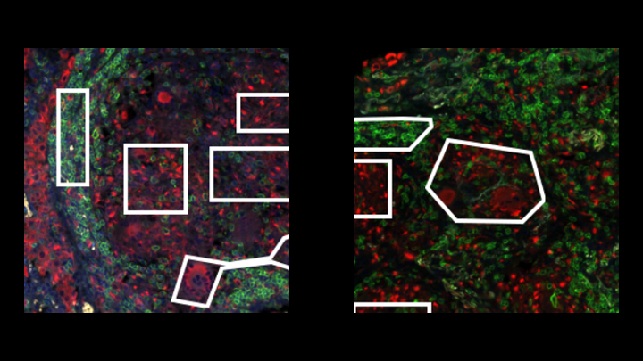
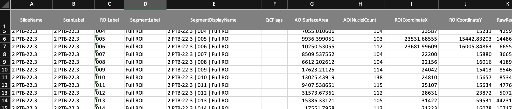
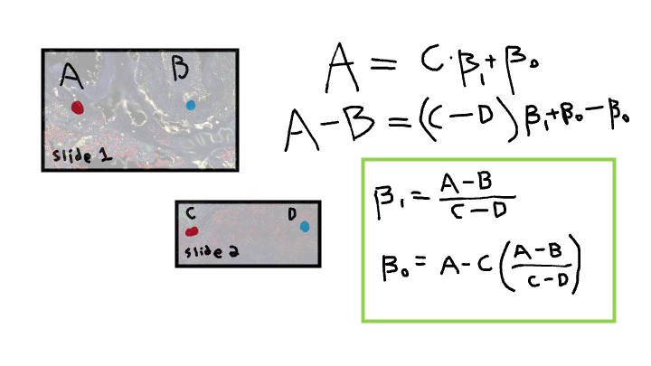
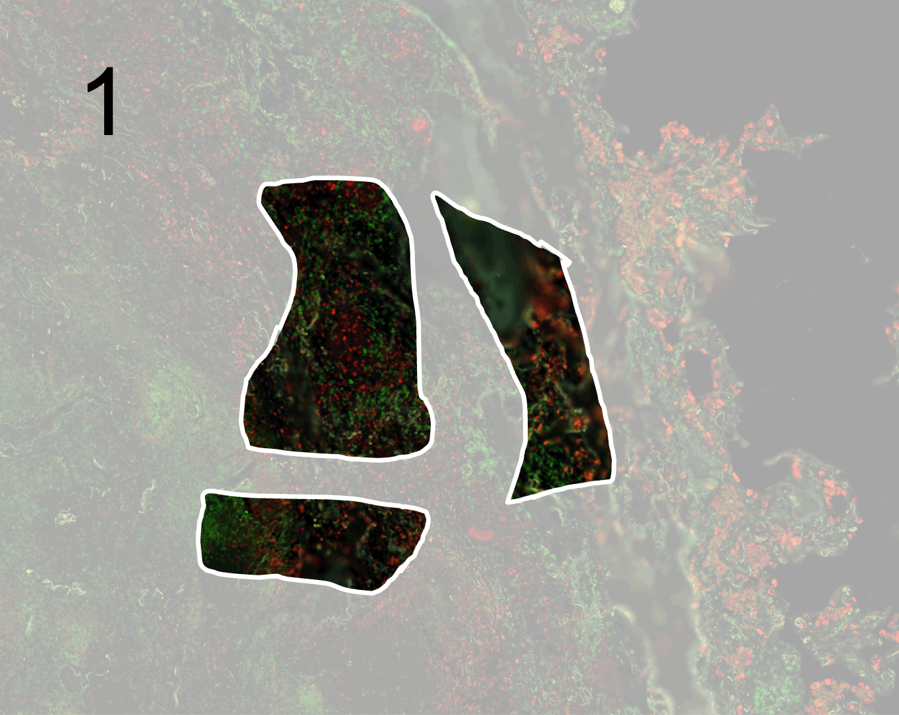

## Overview 

GeoMx Digital Spatial Profiler measures RNA transcripts for ~100–1,000 cells per ROI over the whole transcriptome gene panel. The spots are selected based on H&E stains and morphological markers (typically for us: CD68—red, CD3—green, DAPI—blue, CD20—yellow). In general for publications with GeoMx, you want to show these spots based on their protein stains as you contrast them transcriptomically. 

We uploaded all of the data to [Zenodo](https://zenodo.org/uploads/15750734), but it is currently embargoed until I upload a missing CosMx protein batch or the paper gets accepted (possibly into 2026).

Here are two GeoMx spots as composite images with their bounding boxes shown after processing. 



*Example of full composites without annotations on Zenodo in bb_comp in PTB221_8.png and PTB223_9.png.*

## Overlapping boxes 

One of the problems for two of our four batches (ran externally) was that the high quality images provided had spot boxes overlapping with annotations, making them not suitable for publication. The external collaborators had annotation-free images of the whole tissue, but these did not have all of the channels as a composite, and the annotation style was more blocky. 



*Example of overlapping spots using external source images on Zenodo in bb_original in "1 PTB-22.1 - 008.tiff" and "2 PTB-22.3 - 009.tiff".*



*Example of partial composites without annotations on Zenodo in bb_annot in PTB221_8.png and PTB223_9.png.*


## Recreating boxes 

The code is on [GitHub](https://github.com/modlab246/TREM2_PTB/blob/main/geomx/img/save_bb.ipynb) as a Jupyter Notebook in the repository for the paper. We opted to recreate the composite images from the raw protein channels that did not have annotations. The spot coordinates map to the pixels, so when we look at the area around ROICoordinateX and ROICoordinateY from the metadata, we can find the location of some spot. 



*Spreadsheet rows for GeoMx spots on Zenodo in data folder in geomx_221_223.xlsx.*

In this code block from the other notebook [to create composite images of the spots without boxes](https://github.com/modlab246/TREM2_PTB/blob/main/geomx/img/save_channel.ipynb), we loaded the X and Y coordinates flipped and then found that region for each spot. Note that these were large files requiring GBs of RAM, hence, for best practice we cleared memory after loading was complete. 

<pre>
```Python
# DAPI stain
mat = io.imread("../channel/PTB22.3_Blue.tiff")
img={}
for spot in df.iterrows():
    y,x=spot[1][["ROICoordinateX","ROICoordinateY"]]
    roi=spot[1][["ROILabel"]].astype(int).values[0]
    x=int(x)
    y=int(y)
    img[roi]=mat[(x-xw):(x+xw),(y-xw):(y+xw)]

for x in img:
    np.save("../crop/223/"+"BLUE_"+str(x)+".npy",img[x])

del img
del mat
</pre>

## Mapping coordinates 
The bounding boxes without annotations provided externally did not have the same dimensions as the raw protein images. They were mislaigned, hence, we had to find the transformation from our raw protein coordinates to the spot boxes. We took the coordinates of two spots from the spreadsheet and then found their pixel coordinates in the adjusted image. This allowed us to find the position of the bounding boxes for each spot and then isolate and apply them to the new composites. 



*Coordinate transformation from raw protein channels with GeoMx metadata coordinates to bounding box images without coordinates provided.*


## Constructing the bounding box 

First, we would find the transformed coordinates of the spot
<pre>
```Python	
y,x=spot[1][["ROICoordinateX","ROICoordinateY"]]
roi=spot[1][["ROILabel"]].astype(int).values[0]
x=np.round((x*x_221_sf)+x_221_cnst).astype(int)
y=np.round((y*y_221_sf)+y_221_cnst).astype(int)
xw =128

img_bb = mat[(x-xw):(x+xw),(y-xw):(y+xw)]
</pre>

The idea was to find where pixels were white in the image and then find the middle-most point. Flip the matrix to find all non-white points and fill in (flood) the shape that contains the middle-most point. Note that for certain ROIs, some parameters had to be adjusted, so that the resulting boxes did not merge (ROIs 19 and 20 in this code snippet for PTB 22.1).




<pre>
```Python	
# bounding box is white 
white_mask = (img_bb == [255,255,255,255]).all(-1)
white_pixels = np.where(white_mask)

# find the closest point to this middle 
starting_point = np.argmin(np.abs(np.array(white_pixels).T-np.array([img_bb.shape[1]/2,img_bb.shape[0]/2])).sum(1))
# this middle point is then used as the basis for flooding the mask layer 
mid_point = (white_pixels[1][starting_point],white_pixels[0][starting_point])

dilation_iter = 1

# 19 and 20 are in contact, so we cannot flood their outlines 
if roi in [19,20]:
    flood_mask = white_mask.astype(np.uint8).copy()
    _, flood_mask, _, _ = cv2.floodFill(flood_mask, None, (int(img_bb.shape[1]/2),int(img_bb.shape[0]/2)), 2)
    interior_mask = (flood_mask == 2)
    dilation_iter = 3
else:
    flood_mask = ~white_mask.astype(np.uint8).copy()
    _, flood_mask, _, _ = cv2.floodFill(flood_mask, None, mid_point, 2)
    interior_mask = (flood_mask == 2)

image = (~(binary_dilation(interior_mask, structure=np.ones((3,3)), iterations = dilation_iter) & white_mask)).astype(np.uint8)*255
</pre>

Afterwards we just applied some smoothing to the mask and combined it with the composite images per spot that we regenerated before saving the various versions of the GeoMx spot. 

<pre>
```Python	
target_image = cv2.imread(comp[roi], cv2.IMREAD_UNCHANGED) 

smooth_image = ndimage.gaussian_filter(image, sigma=3)
resized_smooth_image = cv2.resize(smooth_image, (target_image.shape[1], target_image.shape[0]))
mask = ~(resized_smooth_image>200)

# mask has two colors, empty and white mask with low alpha 
colors = [(0, 0, 0, 0), (1, 1, 1, 0.25)] 
cmap = mcolors.LinearSegmentedColormap.from_list('my_cmap', colors, N=2)

gaus_mask = ndimage.gaussian_filter(mask, sigma=3)
dilate_mask = cv2.dilate(gaus_mask.astype(np.uint8), None, iterations=3)
final_mask = cv2.erode(dilate_mask.astype(np.uint8), None, iterations=9)

np.save("../bb_mask/"+"PTB221_"+(str(roi))+".npy",final_mask)

# bounding box + composite 
fig,ax=plt.subplots(figsize=(16,16))
plt.imshow(cv2.cvtColor(target_image, cv2.COLOR_BGRA2RGBA))
plt.imshow(final_mask,cmap=cmap)
plt.axis("off")
plt.savefig("../bb_comp/"+"PTB221_"+(str(roi)),dpi=400,bbox_inches='tight', pad_inches=0)
plt.close(fig)
plt.clf()

# original annotation bounding box
fig,ax=plt.subplots(figsize=(16,16))
plt.imshow(img_bb)
plt.axis("off")
plt.savefig("../bb_annot/"+"PTB221_"+(str(roi)),dpi=400,bbox_inches='tight', pad_inches=0)
plt.close(fig)
plt.clf()

# cut out of composite within bounding box 
filled_mask = ndi.binary_fill_holes(final_mask)
masked_image = np.zeros_like(target_image,)
masked_image[filled_mask == 1] = target_image[filled_mask == 1]

fig,ax=plt.subplots(figsize=(16,16))
plt.imshow(cv2.cvtColor(masked_image, cv2.COLOR_BGRA2RGBA))
plt.axis("off")
plt.savefig("../bb_comp_mask/"+"PTB221_"+(str(roi)),dpi=400,bbox_inches='tight', pad_inches=0, transparent=True)
plt.close(fig)
plt.clf()
</pre>