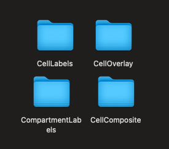
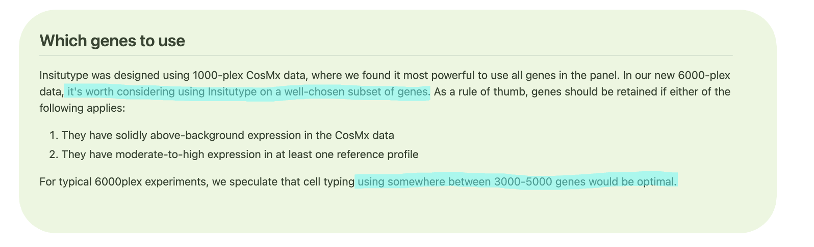
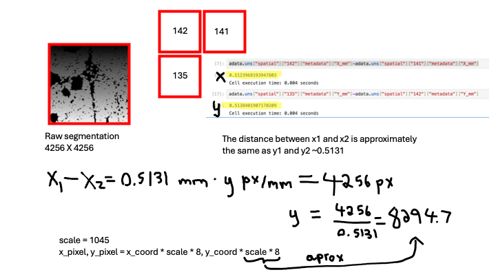
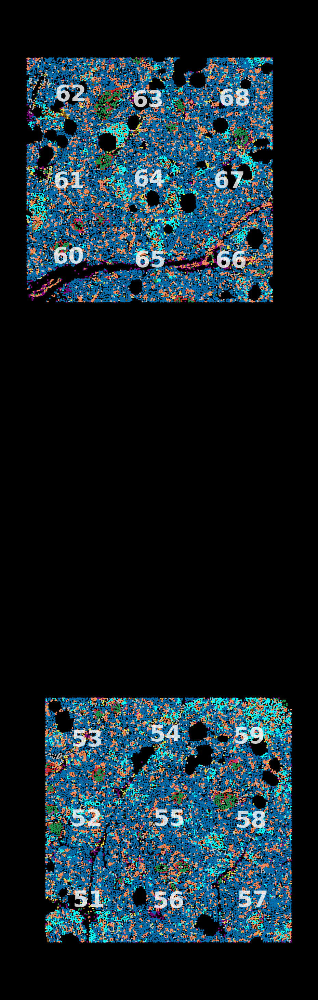
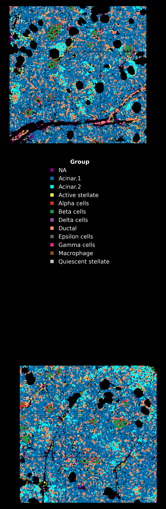
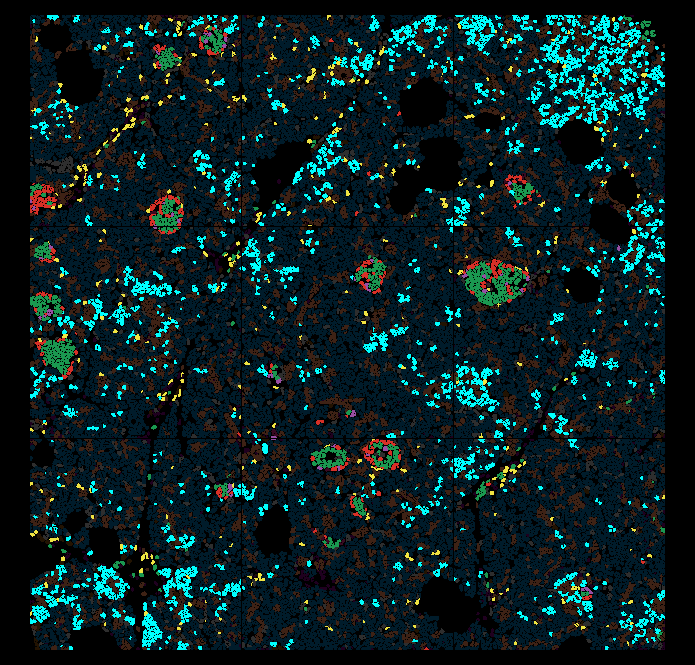
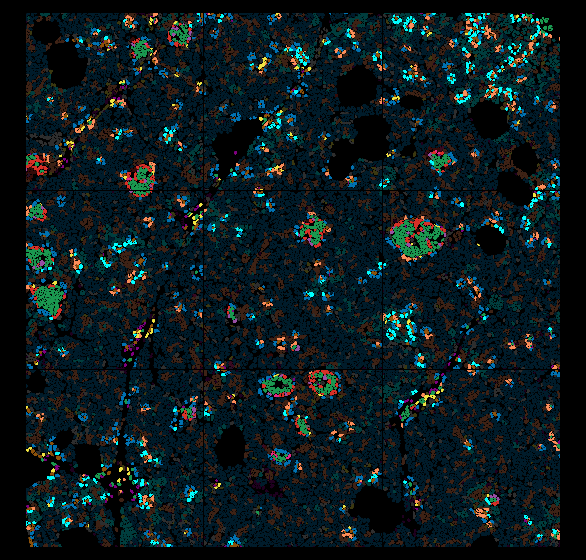
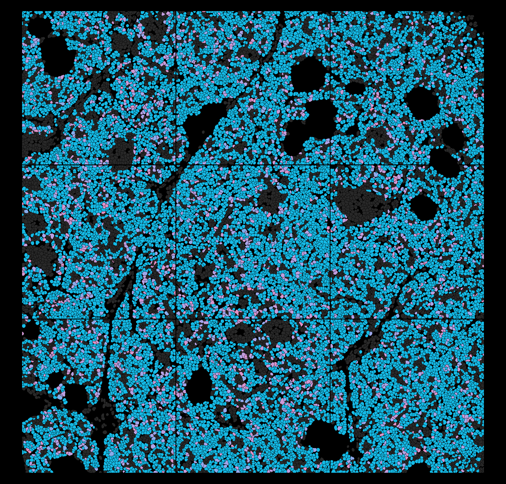

## Basic CosMx workflow 
The goal here is to demonstrate how to make better plots for CosMx than the defaults in Python. The main limitation of the other two alternatives listed below is that they do not show how to stitch FOVs together effectively. This is from an exported Jupyter notebook. We cover basic plotting of FOVs, cell outlines, hollow cells, transcripts, spatial proximity, and gradients. 

1. [SquidPy](https://squidpy.readthedocs.io/en/stable/notebooks/tutorials/tutorial_nanostring.html)
2. [Bruker's biostats group](https://nanostring-biostats.github.io/CosMx-Analysis-Scratch-Space/posts/spatial-plotting/)

The data I will be using is the publicly available [Pancreas CosMx data set](https://nanostring.com/products/cosmx-spatial-molecular-imager/ffpe-dataset/cosmx-smi-human-pancreas-ffpe-dataset/) for whole transcriptome. My analysis of pulmonary tuberculosis spatial transcriptomic data is in my [embargoed thesis](https://escholarship.org/uc/item/3bf2h046) in chapter *Spatially resolved macrophages in human pulmonary tuberculosis*.


```python
from pathlib import Path

import numpy as np

import matplotlib as mpl
import matplotlib.pyplot as plt
import seaborn as sns
import colorcet as cc

import scanpy as sc
import squidpy as sq
import pandas as pd

import re
import os

from PIL import Image

import cv2

from matplotlib.colors import ListedColormap
import matplotlib.patches as mpatches
from skimage.morphology import erosion, square

```


```python
from IPython.core.events import EventManager
from IPython import get_ipython
import time

global_start_time = None

def start_timer(event):
    global global_start_time
    global_start_time = time.time()

def stop_timer(event):
    global global_start_time
    if global_start_time:
        duration = time.time() - global_start_time
        print(f"Cell execution time: {duration:.3f} seconds")
        global_start_time = None

ip = get_ipython()
ip.events.register('pre_run_cell', start_timer)
ip.events.register('post_run_cell', stop_timer)
```


```python
# rename FOV column for squidpy 
df = pd.read_csv("Pancreas_fov_positions_file.csv")
df.rename(columns={"FOV":"fov"}).to_csv("Pancreas_fov_positions_file_fov.csv")
```


```python
adata = sq.read.nanostring(
    path=".",
    counts_file="Pancreas_exprMat_file.csv",
    meta_file="Pancreas_metadata_file.csv",
    fov_file="Pancreas_fov_positions_file_fov.csv",
)
```

```python
tx = pd.read_csv("Pancreas_tx_file.csv",sep=",")
```

```python
tx = tx.drop_duplicates(subset=['x_local_px','y_local_px','fov','target'])
```

```python
fovs = np.array(list(range(51,60)))
tx = tx[tx['fov'].isin(set(fovs))]
```

```python
adata.var["NegPrb"] = adata.var_names.str.startswith("SystemControl") + adata.var_names.str.startswith("Negative")
adata.var_names = [x.replace('_', '-') for x in adata.var_names]

sc.pp.normalize_total(
    adata, target_sum=1e4, inplace=True, exclude_highly_expressed=True, max_fraction=0.25
)
sc.pp.log1p(adata)
```

## Cell matrix maps 

CellComposite and CellLabels are mapped to the keys "hires" and "segmentation" respectively in **adata.uns["spatial"][fov][key]**, but we can add the other components. The segmentation is most important for making plots where cells are not just markers. Sometimes CellComposite is not created and instead you will have a folder Morphology2D, which is all of the morphological markers of the composite as separate tiff layers (the order of layers is consistent with the metadata flat file field order, PanCK, CD68, membrane, CD45, DAPI). These are all located in CellStatsDir, and typically at least CellOverlay and Morphology2D are present. 



*Typical folders for CosMx data.*


```python
def _load_image(path):
    return np.asarray(Image.open(path))

def _load_all_layers(path):
    img = Image.open(path)
    layers = []
    try:
        while True:
            layers.append(np.asarray(img))
            img.seek(img.tell() + 1)
    except EOFError:
        pass
    return layers
```

```python
# load CompartmentLabels and CellOverlay into adata.uns["spatial"][fov][key]
path="/Users/jonathanperrie/Documents/UCLA/projects/cosmx/pancreas"
pat = re.compile(r".*_F(\d+)")
file_extensions = (".jpg", ".png", ".jpeg", ".tif", ".tiff")
for subdir in ["CompartmentLabels","CellOverlay"]:
        if os.path.exists(path +"/"+ subdir) and os.path.isdir(path +"/"+ subdir):
            for fname in os.listdir(path +"/"+ subdir):
                if fname.endswith(file_extensions):
                     fov = str(int(pat.findall(fname)[0]))
                     try:
                         adata.uns["spatial"][fov]["images"][subdir.lower()] = _load_image(path +"/"+ subdir +"/"+ fname)
                     except KeyError:
                         logg.warning(f"FOV `{str(fov)}` does not exist in {subdir} folder, skipping it.")
                         continue
```

```python
# splitting adata genes from negative probes 
mygenes = adata.var.loc[~adata.var.NegPrb].index.values
myprbs = adata.var.loc[adata.var.NegPrb].index.values
adata_nprb = adata[:,myprbs]
adata = adata[:,mygenes]
```

## Cell type labels
With CosMx, the recommendation is to use their specific clustering method, [InSituType](https://github.com/Nanostring-Biostats/InSituType), which offers much flexibility (unsupervised, semi-supervised, supervised). I find it more reliable for RNA than protein. I like to do a first pass with unsupervised clustering before finding a suitable reference. The [recommendation with RNA](https://github.com/Nanostring-Biostats/InSituType/blob/main/FAQs.md) is to use max 3-5k genes as the method was developed for the 1k gene panel. This can be done by finding the genes with the most explanatory power across a previous annotation run like in unsupervised clustering or with a separate related data set. 



*InSituType FAQ specifying how many genes to use for clustering.*

```python
# adapted from Pancreas_celltype_InSituType.rds
sup_ct = pd.read_csv("Pancreas_celltype_InSituType.csv",header=0,index_col=0)

sup_ct.index = (
    sup_ct.index.str.split("_")
    .map(lambda x: f"{x[3]}_{x[2]}")
)

sorted_labels = sorted(sup_ct["cell_types"].unique())
label_dict_sup = {x:idx for idx,x in enumerate(sorted_labels)}
inv_label_dict_sup = {v:k for k,v in label_dict_sup.items()}
```

```python
adata.obs["supervise"] = -1
adata.obs.loc[sup_ct.index,"supervise"] = sup_ct.apply(lambda row: label_dict_sup[row['cell_types']], axis=1)
adata.obs["supervise"] += 1 
adata.obs["supervise"] = adata.obs["supervise"].astype("category")
```

## Mapping functions

1. *get_mm*: map cluster labels onto CellOverlay matrices
2. *plot_domains*: plotting function for FOVs with too many args

The key line to stitching FOVs was finding the proper transformation from FOV coordinates (X_mm, Y_mm) to matrix space. This took a little tickering to find the exact scale where subsequent FOVs were correctly aligned and not overlapping. In the snippet below, we have scale, the x and y coordinates from the FOV, and we are using these to compute an extent, which is where in the grid the current FOV matrix will be plotted. 


```python
scale = 1045
x_pixel, y_pixel = x_coord * scale * 8, y_coord * scale * 8

extent = (x_pixel, x_pixel + matrix_to_plot.shape[1],
          y_pixel, y_pixel + matrix_to_plot.shape[0])
plt.imshow(matrix_to_plot,...,extent=extent)
```

The simple way to find scale is to look in the fov_positions_file and find FOV distances in X and Y. I believe FOVs must be square, so scale should be the same for both. We have divided scale by 8, but it is really just `matrix shape in one dimension (4256 px) / distance of adjacent FOVs (0.50909 mm)`.



*Aproximate scale calculation for FOVs when plotting by matrix.*

```python
def get_mm(segmentation_map, clusters):
    """
    Map cluster labels to matrix with cell_IDs.
    
    segmentation_map : matrix of cell_IDs per FOV
    clusters : dataframe of cluster labels 
    """
    max_cell_id = np.max(segmentation_map)
    # 1-indexed 
    # lookup_table[0] = cluster label for background 
    # lookup_table[1] = cluster label for cell 1
    # ...
    # lookup_table[max_cell_id] = cluster label for cell max_cell_id
    lookup_table = np.zeros(max_cell_id + 1, dtype=int)

    # fill lookup table 
    for cell_id, cluster in enumerate(clusters):
        lookup_table[int(clusters.index[cell_id].split("_")[0])] = int(cluster)+1

    # for each element x in segmentation_map, take lookup_table[x]
    mapped_matrix = lookup_table[segmentation_map]
    return mapped_matrix
```

```python
def plot_domains(
    adata,
    marker_key,
    hex_colors,
    fovs,
    filename,
    figsize=(12, 12),
    dpi=400,
    downsize=False,
    apply_erosion=0,
    plot_legend=True,
    legendx=1.05,
    legendy=1,
    plot_comp=False,
    inv_labels=None,
    alpha_key=None,
    alpha_vals=None,
    target_genes=[],
    gene_colors=[],
    gene_alphas=[]
):
    """
    Stitches FOVs to plot cells using segmentation maps. 
    
    adata : spatial object 
    marker_key : cell type labels 
    hex_colors : colors 
    fovs : fovs to plot as str array
    filename : filename 
    figsize : figsize 
    dpi : dpi
    downsize : shrink matrix, legacy parameter does not reduce size of plot 
    apply_erosion : (0,1,2) -> (no erosion, cells with outlines, cell outlines)
    plot_legend : legend,
    legendx : legend x-coordinate
    legendy : legend y-coordinate 
    inv_labels : maps cluster indices to legend labels, legacy parameter 
    alpha_key : key for alphas 
    alpha_vals : key annotations that are shown 
    target_genes : genes to display 
    gene_colors : gene colors
    gene_alphas : gene alphas 
    """
    # colormap with background as black 
    cmap = ListedColormap(["black"] + hex_colors)
    
    # legend indices excluding grey as placeholder, legacy code 
    legend_indices = [i for i, color in enumerate(hex_colors) if color.lower() != "grey"]
    
    if inv_labels is None:
        inv_labels = {i: str(i) for i in range(len(hex_colors))}
    
    # placeholders for plot boundaries 
    maxy, maxx, minx, miny = (0, 0, 1E6, 1E6)
    # key scaling factor to go from one matrix to many 
    scale = 1045  
    
    fig, ax = plt.subplots(figsize=figsize)
    for fov in fovs:
        # get metadata and segmentation image for this FOV
        metadata = adata.uns["spatial"][fov]["metadata"].copy()
        segmentation_map = adata.uns["spatial"][fov]["images"]["segmentation"].copy()
        
        # compute cluster mapping from marker_key
        leiden_clusters = adata.obs.loc[adata.obs.fov == fov, marker_key]
        matrix = np.array(get_mm(segmentation_map, leiden_clusters)).astype(np.uint8)
        
        # mapping alpha values to matrix 
        if alpha_key is not None:
            alpha_clusters = adata.obs.loc[adata.obs.fov == fov, alpha_key]
            alpha_matrix_base = np.array(get_mm(segmentation_map, alpha_clusters)).astype(np.uint8)
            alpha_matrix_empty_bool = alpha_matrix_base == 0
            
            alpha_matrix = np.zeros_like(alpha_matrix_base, dtype=float)
            
            # for each cluster index in alpha_vals, add an intensity of 1 if the pixel belongs to that cluster
            if alpha_vals is not None:
                for ng_idx in alpha_vals:
                    alpha_matrix += (alpha_matrix_base == (ng_idx + 1)).astype(float)
            else:
                alpha_matrix = np.ones_like(alpha_matrix_base, dtype=float)
                
            # set baseline intensity of 0.25 for pixels in other cluster indices 
            alpha_matrix[alpha_matrix == 0] = 0.25
            alpha_matrix[alpha_matrix_empty_bool] = 0
        else:
            alpha_matrix = np.where(matrix > 0, 1.0, 0.0)
        
        # apply erosion to smooth segmentation boundaries
        if apply_erosion:
            eroded_seg = erosion(segmentation_map, square(11))

            # outlines 
            if apply_erosion == 1:
                matrix[segmentation_map != eroded_seg] = 0
                alpha_matrix[segmentation_map != eroded_seg] = 0
            # hollow cells 
            if apply_erosion == 2:
                matrix[segmentation_map == eroded_seg] = 0
                alpha_matrix[segmentation_map == eroded_seg] = 0
        
        # convert spatial coordinates (mm) to pixel space using a scale factor.
        x_coord, y_coord = metadata['X_mm'], metadata['Y_mm']

        # shrink matrix from 4256 to 532, not good with erosion, legacy code 
        if downsize:
            x_pixel, y_pixel = x_coord * scale, y_coord * scale
            target_size = (matrix.shape[0] // 8, matrix.shape[1] // 8)
            downsized_matrix = cv2.resize(matrix, target_size, interpolation=cv2.INTER_NEAREST)
            downsized_alpha = cv2.resize(alpha_matrix, target_size, interpolation=cv2.INTER_NEAREST)
            matrix_to_plot = downsized_matrix
            alpha_to_plot = downsized_alpha
        else:
            x_pixel, y_pixel = x_coord * scale * 8, y_coord * scale * 8
            matrix_to_plot = matrix
            alpha_to_plot = alpha_matrix
            
        maxx = max(maxx, x_pixel + matrix_to_plot.shape[1])
        maxy = max(maxy, y_pixel + matrix_to_plot.shape[0])
        minx = min(minx, x_pixel)
        miny = min(miny, y_pixel)

        # coordinates of current map 
        extent = (x_pixel, x_pixel + matrix_to_plot.shape[1],
                  y_pixel, y_pixel + matrix_to_plot.shape[0])

        # alternatively just plot composite 
        if plot_comp:
            composite_map = adata.uns["spatial"][fov]["images"]["hires"].copy()
            ax.imshow(composite_map, extent=extent,interpolation='none',alpha=1)
        else:
            # plot current FOV with alpha map
            ax.imshow(
                matrix_to_plot,
                alpha=alpha_to_plot,
                extent=extent,
                interpolation='none',
                cmap=cmap,
                vmin=0,
                vmax=len(hex_colors),
                zorder=1
            )

        # plotting transcripts 
        if len(target_genes) > 0 and len(target_genes) == len(gene_colors) and len(target_genes) == len(gene_alphas):
            fov_tx = tx[tx['fov'] == int(fov)].copy()
        
            # Adjust the local coordinates to match the global plot coordinates
            fov_tx['x_plot'] = x_pixel + fov_tx['x_local_px']
            fov_tx['y_plot'] = y_pixel + matrix.shape[0] - fov_tx['y_local_px']
            
            gene_color_map = dict(zip(target_genes, gene_colors))
            gene_alpha_map = dict(zip(target_genes, gene_alphas))
        
            for gene in target_genes:
                gene_tx = fov_tx[fov_tx['target'] == gene]
                # Default to white if gene not in map
                color = gene_color_map.get(gene, 'white')  
                alpha = gene_alpha_map.get(gene, 0)
                ax.scatter(
                    gene_tx['x_plot'],
                    gene_tx['y_plot'],
                    s=10,  
                    c=color,
                    alpha=alpha,
                    edgecolor='none',
                    zorder=0
                )

       
    # add legend automatically based on non-grey colors
    if plot_legend:
        handles = [
            mpatches.Rectangle((0, 0), width=1, height=1, color=hex_colors[i],
                               label=inv_labels.get(i, str(i)), ec='black', lw=1)
            for i in legend_indices
        ]
        legend_obj = ax.legend(
            handles=handles,
            handlelength=0.7,
            loc='upper right',
            title="Group",
            bbox_to_anchor=(legendx, legendy),
            frameon=False,
            labelcolor="white", 
            ncol=1,
            title_fontproperties={'weight': 'bold'}
        )
        legend_obj.get_title().set_color('white')
    
    # adjust boundaries 
    ax.set_xlim([minx - 500, maxx + 500])
    ax.set_ylim([miny - 200, maxy + 200])
    ax.invert_yaxis()
    plt.axis("off")
    fig.patch.set_facecolor('black')
    ax.set_facecolor('black')
    
    plt.savefig(filename, dpi=dpi, bbox_inches='tight')
    plt.close(fig)

```

```python
def get_hex_colors_pancreas():
    """
    0  Acinar.1             #0072B2  deep/royal blue
    1  Acinar.2             #00FFFF  cyan
    2  Active stellate      #F0E442  bright yellow
    3  Alpha cells          #D73027  warm red
    4  Beta cells           #1A9850  medium green
    5  Delta cells          #984EA3  purple
    6  Ductal               #FC8D59  orange / salmon
    7  Epsilon cells        #636363  dark gray
    8  Gamma cells          #E7298A  magenta / hot pink
    9  Macrophage           #8C510A  dark brown
    10 Quiescent stellate   #BDBDBD  light gray
    """
    return [
        "#0072B2",
        "#00FFFF",
        "#F0E442",
        "#D73027",
        "#1A9850",
        "#984EA3",
        "#FC8D59",
        "#636363",
        "#E7298A",
        "#8C510A",
        "#BDBDBD",
    ]
```

```python
# define the names corresponding to the clusters
cluster_names = [
    "NA"
] + list(label_dict_sup.keys())

# create inv_labels mapping
inv_labels = {i: cluster_names[i] for i in range(len(cluster_names))}
hex_colors = ["purple"] + get_hex_colors_pancreas()
hex_colors = list(hex_colors)
```

```python
# extract coordinates and FOV information into a DataFrame for easy manipulation
data = pd.DataFrame({
    'x': adata.obs['CenterX_global_px'].values/5000,
    'y': adata.obs['CenterY_global_px'].values/5000,
    'fov': adata.obs["fov"].values,
    'cluster': adata.obs["supervise"].values
})

# calculate the mean coordinates for each FOV
fov_means = data.groupby('fov',observed=False)[['x', 'y']].mean()

# prepare coordinates and colors for scatter plot
x1 = data["x"].values
y1 = data["y"].values
colors = data["cluster"].values

# create a plot with dimensions based on the range of your data
fig, ax = plt.subplots(
    figsize=(np.max(x1) - np.min(x1), np.max(y1) - np.min(y1)),
    facecolor='black'        # figure background
)
ax.set_facecolor('black')    # axes background


# dictionary to hold the scatter plots for legend reference
scatter_plots = {}

# plot each cluster with its own color and label
for lab in np.unique(colors):
    idx = colors == lab
    scatter_plots[lab] = ax.scatter(x1[idx], y1[idx], s=0.75, alpha=1, c=[hex_colors[lab]], label=str(lab), edgecolor="none",zorder=1)

# display a large number for each FOV at its mean coordinates
for fov, (mean_x, mean_y) in fov_means.iterrows():
    ax.text(
        mean_x, mean_y, str(fov),
        fontsize=12, ha='center', va='center',
        color='white',        # switch label color to white
        weight='bold', alpha=0.8,zorder=2
    )

# Hide the axes
ax.axis("off")
ax.invert_yaxis()

plt.savefig("plots/fov_map.png",dpi=400, bbox_inches='tight')
plt.close()
```

## FOVs are split 
As we can see from the FOV map, there are two 3x3 grids of FOVs, and so for later analysis, we just focus on the lower set with FOVs 51 to 59. 



*FOV map of CosMx pancreas data set.*

```python
# call the function without downsampling and with erosion applied
plot_domains(
    adata=adata,
    marker_key = "supervise",
    hex_colors=hex_colors,
    fovs=adata.obs.fov.unique(),
    filename="plots/full_ct_plot.png",
    figsize = (16,16),
    dpi=400,
    apply_erosion=False,
    inv_labels=inv_labels,
    plot_legend=True,
    legendx=0.7,legendy=0.7
)
```



*All cell types across all FOVs with legend.*


```python
# call the function without downsampling and with erosion applied
plot_domains(
    adata=adata,
    marker_key = "supervise",
    hex_colors=hex_colors,
    fovs=np.array(list(range(51,60))).astype(str),
    filename="plots/half_ct_plot.png",
    figsize = (16,16),
    dpi=400,
    apply_erosion=1,
    inv_labels=inv_labels,
    plot_legend=False,
    alpha_key="supervise",
    alpha_vals=[2,3,4,5,6],
)
```



*Select cell types highlighted with alpha arg.*

## Displaying genes
Note the marker size is a little big, and with more abundant transcripts, you'll want to lower the gene alpha for that particular gene, so it doesn't overwhelm the plot. This style of plot can be useful when some gene is a marker but still highly variable within a cell type.


```python
target_genes = ["IAPP","SPP1","CD68","CD3E"]
gene_colors = [
    "pink",  
    "blue",  
     "red", 
    "purple", 
]
alphas = [0.6,0.6,0.6,0.6]

# call the function with genes and hollow cells 
plot_domains(
    adata=adata,
    marker_key = "supervise",
    hex_colors=hex_colors,
    fovs=np.array(list(range(51,60))).astype(str),
    filename="plots/half_tx_plot.png",
    figsize = (16,16),
    dpi=400,
    apply_erosion=2,
    inv_labels=inv_labels,
    plot_legend=False,
    alpha_key="supervise",
    alpha_vals=[2,3,4,5,6],
    target_genes=target_genes,
    gene_colors = gene_colors,
    gene_alphas = alphas
)
```


*Select cell types with gene transcripts IAPP, SPP1, CD68, and CD3E indicated by pink, blue, red, and purple markers respectively.*

## Contacts 
We can take the contacts from the Delaunay triangulation of the cells and use them to display only cells touching particular types.
For example, all cells touching macrophages (brown, 9) and all cells touching beta cells (green, 4). 


```python
adata.obs["supervise"] = adata.obs["supervise"].astype("category") 
adata.obsm['global_spatial'] = adata.obs[['CenterX_global_px', 'CenterY_global_px']].values
sq.gr.spatial_neighbors(adata, spatial_key='global_spatial', coord_type='generic', delaunay=True)
sq.gr.nhood_enrichment(adata, cluster_key="supervise")
```


```python
group_pos = {}
group_idx = {}
for i in range(adata.obs.supervise.unique().astype(int).max()):
    group_pos[i] = np.where(adata.obs['supervise'] == i)[0]
    group_idx[i] = adata.obs.index[group_pos[i]]
```


```python
def get_interacting_indices(pos1, pos2, idx1, idx2):
    """
    Helper function to get interacting indices for a pair of groups.
    
    pos1, pos2 : numpy arrays of row positions
    idx1, idx2 : indices (pd.Index) that correspond to pos1 and pos2
    """
    interaction_matrix = adata.obsp['spatial_connectivities'][np.ix_(pos1, pos2)]
    rows, cols = interaction_matrix.nonzero()
    
    return np.array(list(idx1[rows]) + list(idx2[cols]))
```


```python
# find all contacts, note we have to index + 1 again 
A_idx = 4+1
groupA_intersections = {}
for i in range(adata.obs.supervise.unique().astype(int).max()):
    groupA_intersections[i] = get_interacting_indices(group_pos[A_idx], group_pos[i], group_idx[A_idx], group_idx[i])

B_idx = 9+1
groupB_intersections = {}
for i in range(adata.obs.supervise.unique().astype(int).max()):
    groupB_intersections[i] = get_interacting_indices(group_pos[B_idx], group_pos[i], group_idx[B_idx], group_idx[i])
```

```python
all_interacting_idx = np.concatenate(list(groupA_intersections.values())+list(groupB_intersections.values()))
all_interacting_idx = np.unique(all_interacting_idx)
all_interacting_idx_set = set(all_interacting_idx)
```


```python
# we create a new metadata variable 
adata.obs["interact"] = 0
adata.obs.loc[list(all_interacting_idx_set),"interact"]=1
```


```python
# call the function on interactions 
plot_domains(
    adata=adata,
    marker_key = "supervise",
    hex_colors=hex_colors,
    fovs=np.array(list(range(51,60))).astype(str),
    filename="plots/interact_ct_plot.png",
    figsize = (16,16),
    dpi=400,
    apply_erosion=1,
    inv_labels=inv_labels,
    plot_legend=False,
    alpha_key="interact",
    alpha_vals=[1],
)
```



*Cell types in contact with macrophage and beta cells.* 

## Plotting a gradient over some cells 
If we want to look at acinar cell types 1 and 2 and their relative expression of SPP1, then we can construct a spectrum of expression. Recall that the counts have already been scaled with log1p. If we scale the expression values to 0-1, then we can map these values to a color gradient and attach this to the adata metadata obs. 


```python
# scaling expression for SPP1 for acinar cell types 1 and 2 
gene_expr = adata[adata.obs.supervise.isin(np.array([1,2])),:][:,adata.var.index=="SPP1"].X.toarray().ravel()
scale_expr = (gene_expr - gene_expr.min()) / (gene_expr.max() - gene_expr.min())
```

```python
# 256 bins 
bin_edges = np.linspace(scale_expr.min(), scale_expr.max(), 256)
adata.obs['bin'] = 0

# upscale from 0-1 to 256 scale 
adata.obs.loc[adata.obs.supervise.isin(np.array([1,2])), 'bin'] = np.digitize(scale_expr, bin_edges)

# get 256 colors from viridis
cmap = cc.cm.CET_I3  
spc_colors = [mpl.colors.to_hex(cmap(i / 255)) for i in range(256)]
# grey as our default for excluded cells 
spc_colors = ['#A6A6A6'] + spc_colors
```

```python
# call the function with a gradient 
plot_domains(
    adata=adata,
    marker_key = "bin",
    hex_colors=spc_colors,
    fovs=np.array(list(range(51,60))).astype(str),
    filename="plots/spectrum_ct_plot.png",
    figsize = (16,16),
    dpi=400,
    apply_erosion=1,
    inv_labels=inv_labels,
    plot_legend=False,
    alpha_key="supervise",
    alpha_vals=[1,2],
)
```



*Spectrum of expression of SPP1 in acinar cell types 1 and 2.*
