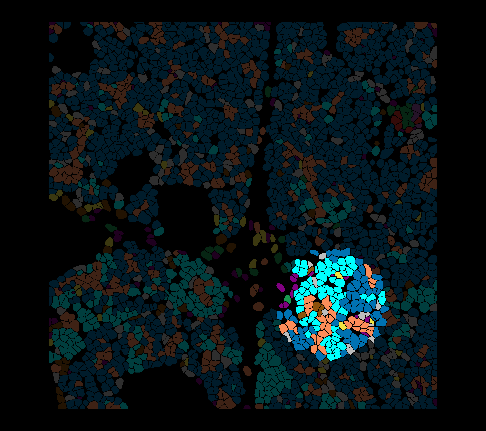
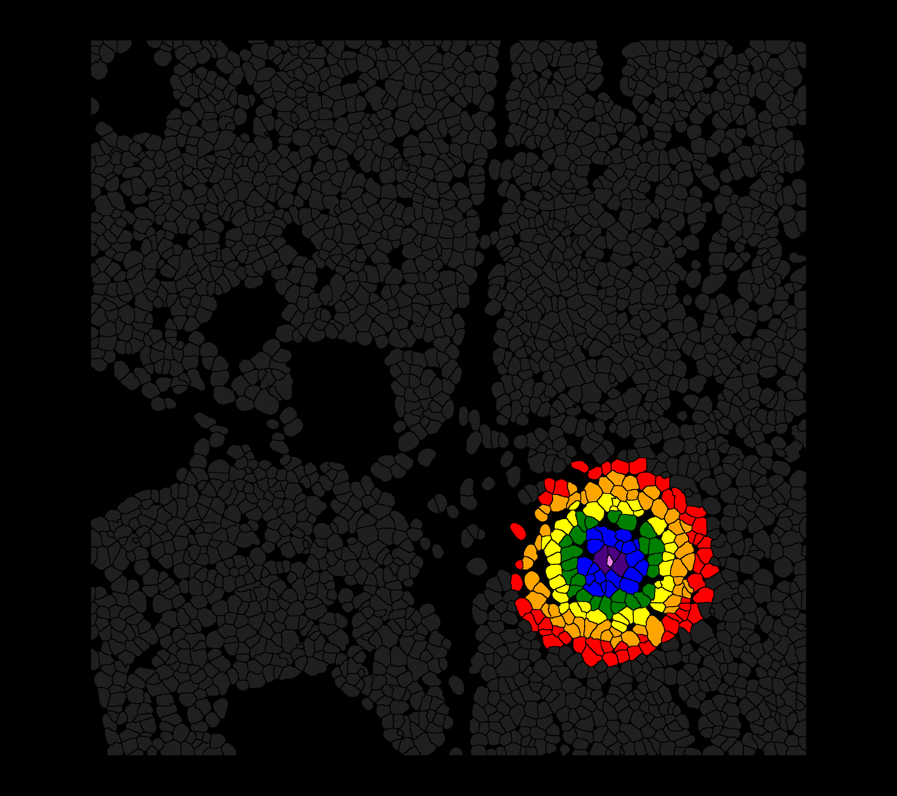
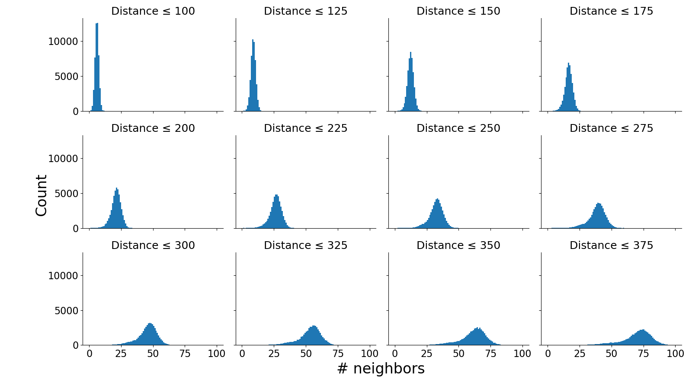
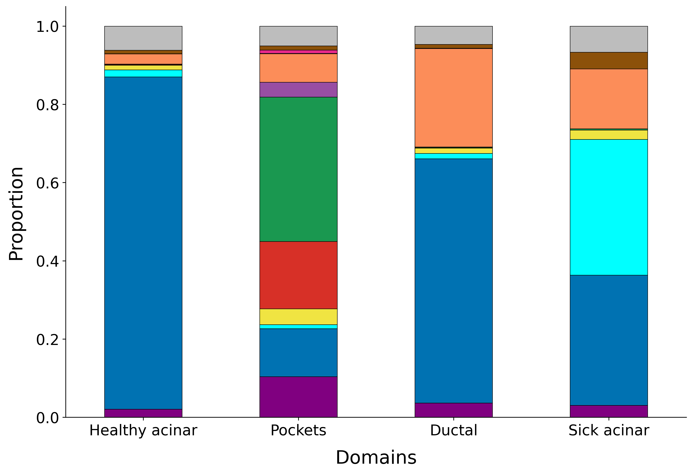
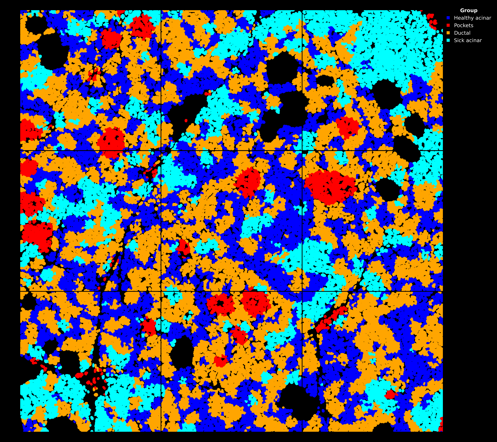
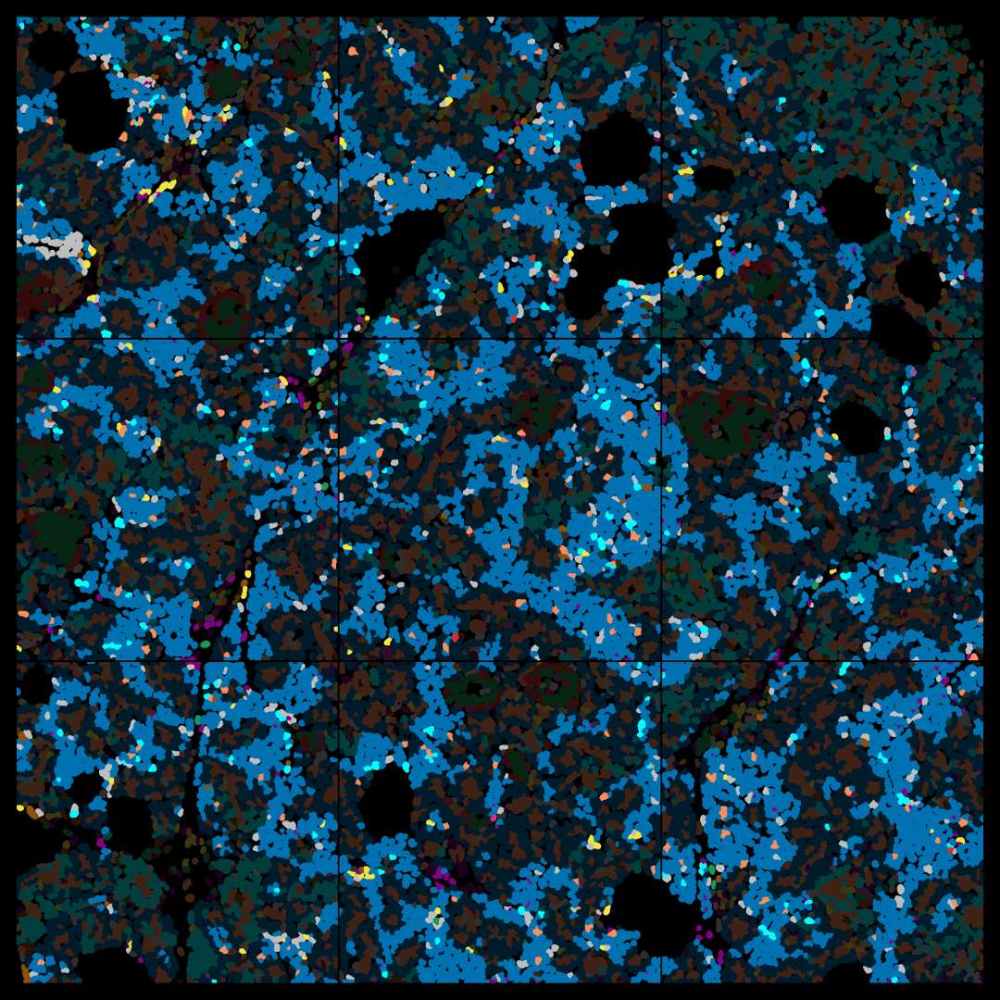

## Domains

The nice thing about calling clusters of clusters is low-quality cells no longer need to be discarded because every cell is now pooled with the information of its local environment. 

Here, we are just using the public pancreas data set, but for tuberculosis, we had CosMx runs on two separate tissues with 1k and 6k genes. This takes off where we left off in the previous post "Plotting CosMx FOVs".

There are two basic ways to call domains as [outlined by Bruker's biostats group](https://nanostring-biostats.github.io/CosMx-Analysis-Scratch-Space/posts/cellular-neighborhoods/cellular-neighborhoods.html):
1. Pooling gene expression (referred to as radius-based approach) 
2. Pooling cell type labels (referred to as KNN approach)

In both cases, you take an aggregate representation and then cluster it. Pooling gene expression allows for smoother transcriptomic gradients, but unless you are using a complex clustering algorithm, this approach can be hindered by FOV-specific batch effects that InSituType is able to effectively handle at the single-cell level. 

By pooling labels, we can integrate data sets with different feature sets (1k and 6k gene features), and theoretically, you could find domains across data modalities like between transcript and protein. 

## Finding nearest neighbors 
Below, we find the 200 nearest neighbors for every cell. `spatial_fov` contains the (x,y) coordinates in mm. 


```python
import math 
from collections import Counter

from sklearn.neighbors import NearestNeighbors
from sklearn.cluster import KMeans
from sklearn.preprocessing import normalize

from matplotlib.ticker import MultipleLocator
from matplotlib.ticker import MaxNLocator
```

```python
n_neighbors = 200   

spatial_coords = adata.obsm["spatial_fov"]   
nbrs = NearestNeighbors(n_neighbors=n_neighbors, algorithm='ball_tree').fit(spatial_coords)
distances, indices = nbrs.kneighbors(spatial_coords)
n_samples = spatial_coords.shape[0]
```


Consider a random cell, we can look at its neighborhood. 


```python
# the index for a hand-picked cell 
i=750
adata.obs.iloc[i].head()
```

```output 
    fov              51
    Area           2157
    AspectRatio    0.54
    Width            41
    Height           76
    Name: 751_51, dtype: object
```

```python
# defining interact terms by spatial proximity 
adata.obs["interact2"] = 0
adata.obs.loc[list(adata.obs.index[indices[i][distances[i] < 600]]),"interact2"]=1
adata.obs.loc[list(adata.obs.index[indices[i][distances[i] < 500]]),"interact2"]=2
adata.obs.loc[list(adata.obs.index[indices[i][distances[i] < 400]]),"interact2"]=3
adata.obs.loc[list(adata.obs.index[indices[i][distances[i] < 300]]),"interact2"]=4
adata.obs.loc[list(adata.obs.index[indices[i][distances[i] < 200]]),"interact2"]=5
adata.obs.loc[list(adata.obs.index[indices[i][distances[i] < 100]]),"interact2"]=6
adata.obs.loc[list(adata.obs.index[indices[i][distances[i] < 1]]),"interact2"]=7

adata.obs["interact3"] = 0
adata.obs.loc[adata.obs["interact2"]>0,"interact3"]=1
```

```python
# call the function on interactions 
plot_domains(
    adata=adata,
    marker_key = "supervise",
    hex_colors=hex_colors,
    fovs=np.array(["51"]),
    filename="plots/cell_neighbors.png",
    figsize = (16,16),
    dpi=400,
    apply_erosion=1,
    inv_labels=inv_labels,
    plot_legend=False,
    alpha_key="interact3",
    alpha_vals=[1],
)
```

```python
# call the function on interactions 
plot_domains(
    adata=adata,
    marker_key = "interact2",
    hex_colors=["grey","red","orange","yellow","green","blue","indigo","violet"],
    fovs=np.array(["51"]),
    filename="plots/cell_neighbors_rainbow.png",
    figsize = (16,16),
    dpi=400,
    apply_erosion=1,
    inv_labels=inv_labels,
    plot_legend=False,
    alpha_key="interact3",
    alpha_vals=[1],
)
```

<div style="display:flex; gap:12px;">
  
  
</div>

*This ductal cell is surrounded by type 2 acinar cells. (Left) Local neighborhood highlighted within distance of 600. (Right) Expanding the neighborhood, colored every 100 units of distance.*

## Vectorization
When we threshold the neighbors of some cell, we want to only get those neighbors that are within the distance threshold. The line of code below returns the indices that have distances lower than `dt` for all cells. 

`sub_indices = [indices[i][distances[i] < dt] for i in range(len(distances))]`

The first way to evaluate this threshold is by just asking how many cells are within a neighborhood on average for a given threshold. Increasing neighborhood size gives a more aggregate picture.


```python
thresholds = np.linspace(100, 375, 12)

n = len(thresholds)
ncols = 4
nrows = math.ceil(n / ncols)

fig, axes = plt.subplots(
    nrows, ncols,
    figsize=(4 * ncols, 3 * nrows),
    squeeze=False,
    sharex=True,
    sharey=True,
)

# iterate through distance thresholds 
for j, dt in enumerate(thresholds):
    row = j // ncols
    col = j % ncols
    ax = axes[row, col]

    # indices within distsance
    sub_indices = [indices[i][distances[i] < dt] for i in range(len(distances))]

    # count the number of indices within some distance threshold 
    ax.hist([len(x) for x in sub_indices], bins=100, range=(0, 100))

    dt_int = int(round(dt))
    ax.set_title(f"Distance ≤ {dt_int}", fontsize=18)

    ax.spines["top"].set_visible(False)
    ax.spines["right"].set_visible(False)
    ax.tick_params(axis="both", labelsize=16)

    sub_fig, sub_ax = plt.subplots()
    sub_ax.hist([len(x) for x in sub_indices], bins="auto")
    sub_ax.set_title(f"Distance ≤ {dt_int}", fontsize=18)
    sub_ax.spines["top"].set_visible(False)
    sub_ax.spines["right"].set_visible(False)
    sub_ax.xaxis.set_major_locator(MaxNLocator(integer=True))
    sub_ax.tick_params(axis="both", labelsize=16)
    sub_ax.set_xlabel("# neighbors", ha="center", fontsize=24)
    sub_ax.set_ylabel("Count", ha="center", fontsize=24)
    sub_fig.tight_layout()
    sub_fig.savefig(f"plots/hist/{dt_int}_distances.png")
    sub_fig.clf()
    plt.close(sub_fig)

for row_axes in axes:
    for ax in row_axes:
        ax.xaxis.set_major_locator(MultipleLocator(25))

for j in range(n, nrows * ncols):
    row = j // ncols
    col = j % ncols
    axes[row, col].axis("off")

fig.text(0.55, 0.04, "# neighbors", ha="center", fontsize=24)
fig.text(0.05, 0.5, "Count", va="center", rotation="vertical", fontsize=24)

plt.tight_layout(rect=[0.06, 0.06, 1, 1])
plt.savefig("plots/hist_distances.png")
plt.clf()
plt.close()
```

<div class="plot-wrapper">
  


  <div
    class="hotspot"
    style="top:11.6%; left:11%; width:18%; height:20%;"
    data-image-src="../data/hist/100_distances.png"
  ></div>

  <div
    class="hotspot"
    style="top:11.6%; left:30.9%; width:18%; height:20%;"
    data-image-src="../data/hist/125_distances.png"
  ></div>

<div
    class="hotspot"
    style="top:11.6%; left:50.8%; width:18%; height:20%;"
    data-image-src="../data/hist/150_distances.png"
  ></div>

  <div
    class="hotspot"
    style="top:11.6%; left:70.7%; width:18%; height:20%;"
    data-image-src="../data/hist/175_distances.png"
  ></div>

<div
    class="hotspot"
    style="top:37.1%; left:11%; width:18%; height:20%;"
    data-image-src="../data/hist/200_distances.png"
  ></div>

<div
    class="hotspot"
    style="top:37.1%; left:30.9%; width:18%; height:20%;"
    data-image-src="../data/hist/225_distances.png"
  ></div>

<div
    class="hotspot"
    style="top:37.1%; left:50.8%; width:18%; height:20%;"
    data-image-src="../data/hist/250_distances.png"
  ></div>

  <div
    class="hotspot"
    style="top:37.1%; left:70.7%; width:18%; height:20%;"
    data-image-src="../data/hist/275_distances.png"
  ></div>

  <div
    class="hotspot"
    style="top:62.6%; left:11%; width:18%; height:20%;"
    data-image-src="../data/hist/300_distances.png"
  ></div>

<div
    class="hotspot"
    style="top:62.6%; left:30.9%; width:18%; height:20%;"
    data-image-src="../data/hist/325_distances.png"
  ></div>

<div
    class="hotspot"
    style="top:62.6%; left:50.8%; width:18%; height:20%;"
    data-image-src="../data/hist/350_distances.png"
  ></div>

  <div
    class="hotspot"
    style="top:62.6%; left:70.7%; width:18%; height:20%;"
    data-image-src="../data/hist/375_distances.png"
  ></div>

  <!-- Detail plot that changes when you click A/B/C -->
  
</div>

*(Interactive) The number of neighbors for a given distance threshold.*


A distance of 200 gives us around 20 neighbors for the average cell. 


```python
dt = 200
sub_indices = [indices[i][distances[i] < dt] for i in range(len(distances))]
```

Getting a count of all labels within each cell's neighborhood and then normalizing with the square root of L1. I cannot remember exactly why I started adding the square root, but previously using just L1 normalization was fine. 
* L1 was used so all cells have counts that sum to 1
* The square root was taken to inflate rare types


```python
vec_len = len(adata.obs['supervise'].cat.categories)
sub_vec = []

for idxs in sub_indices:
    cnt = Counter(adata.obs['supervise'].values[idxs])
    sub_vec.append([cnt.get(i, 0) for i in range(vec_len)])
    
data_norm = normalize(sub_vec, norm='l1')
data_sqrt = np.sqrt(data_norm)
```

Now we run k-means clustering, though really any clustering algorithm is will work, but k-means can finish quite fast for even large single-cell data sets with 100k+ cells. Previously when trying slower clustering algorithms like spectral clustering, I took a random sample of ~10% of the data for clustering and then used nearest neighbors with label propagation, and I found this to be pretty effective.

## Clustering
Next, we cluster the cells and assign them back to the `adata` object. As there are 12 clusters, we don't want to overcomplicate the picture, so choosing a k less than this is reasonable. Like with neighborhood size, one will have to evaluate how parameter choice affects cluster quality. In the [thesis](https://escholarship.org/uc/item/3bf2h046), we used purity and sensitivity as our metrics of choice to zoom in on particular domain clusters and the cell types.
* Purity: If domain z contains 100 cells, of which 50 are TREM2+ macrophages, then its purity for TREM2+ macrophages is 50%.
* Sensitivity: If there are 200 TREM2+ macrophages in total, and domain z contains 70 of them, then its sensitivity for TREM2+ macrophages is 35%.


```python
k = 4
kmeans = KMeans(n_clusters=k, random_state=0)
labels = kmeans.fit_predict(data_sqrt)

adata.obs["domain"] = pd.Categorical(labels)
```

## Domain downstream analysis 
We can evaluate domains based on their composition of cell types, and we can plot our cells based on their domains. Another thing one can do that I touched on briefly in my thesis is differential gene expression between the same cell type across different domains. What we found was often these cells will be influenced by their microenvironment cell composition, so a T cell in a macrophage-rich environment will express more APOE and CD68 over a T cell in a B cell-rich environment, which would express more IGHG1 and CD19.


```python
X_labels = adata.obs["domain"]
Y_labels = adata.obs['supervise']
confusion_matrix = pd.crosstab(X_labels, Y_labels, rownames=['Cell type'], colnames=['Domain'], normalize='index').T

cmap = ListedColormap(hex_colors)
fig, ax = plt.subplots(figsize=(12, 8))
confusion_matrix.T.plot(kind='bar', stacked=True, colormap=cmap, ax=ax,edgecolor='black',linewidth=0.5)
plt.xticks(rotation=0)

plt.legend("off")
ax.legend().set_visible(False)
ax.set_xlabel('Domains', fontsize=20,labelpad=12)
ax.set_ylabel('Proportion', fontsize=20,labelpad=12)
ax.tick_params(axis='both', which='major', labelsize=16)
ax.spines[['right', 'top']].set_visible(False)

dom_names = ["Healthy acinar","Pockets","Ductal", "Sick acinar"]

ax.set_xticklabels(dom_names, rotation=0, ha='center')

plt.savefig("plots/domain_bp.png",dpi=400, bbox_inches='tight')
plt.clf()
plt.close()
```



*Cell type distribution within domains.*


```python
# plotting domains 
plot_domains(
    adata=adata,
    marker_key = "domain",
    hex_colors=["blue","red","orange","cyan"],
    fovs=np.array(list(range(51,60))).astype(str),
    filename="plots/dom_plot.png",
    figsize = (16,16),
    dpi=400,
    apply_erosion=False,
    inv_labels=inv_labels,
    plot_legend=False,
    legendx=0.7,legendy=0.7
)
```



*Domain distribution in FOVs.*


```python
# view of cell types in each domain one at a time 
for i in range(4):
    plot_domains(
        adata=adata,
        marker_key = "supervise",
        hex_colors=hex_colors,
        fovs=np.array(list(range(51,60))).astype(str),
        filename=f"plots/dom_plot_alpha_{i}.png",
        figsize = (16,16),
        dpi=400,
        apply_erosion=False,
        inv_labels=inv_labels,
        plot_legend=False,
        alpha_key="domain",
        alpha_vals=[i],
    )
```



*Spatial section with alpha domains.*

