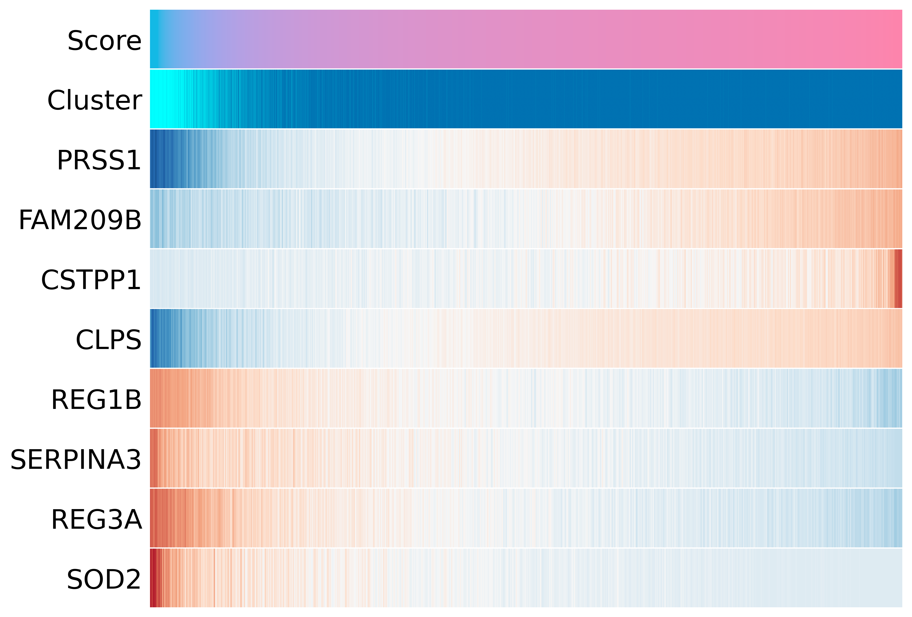
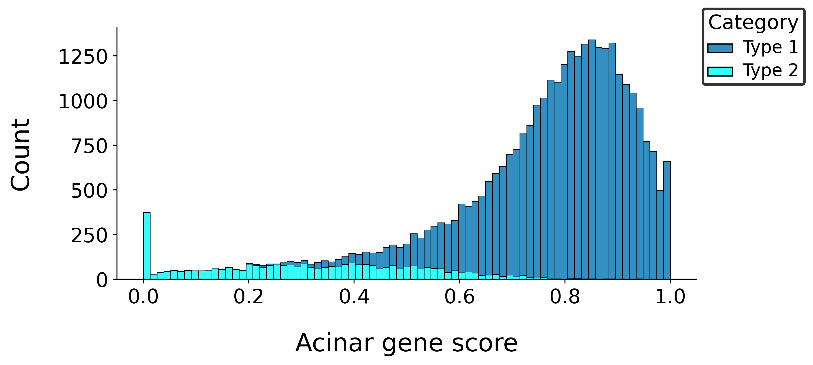
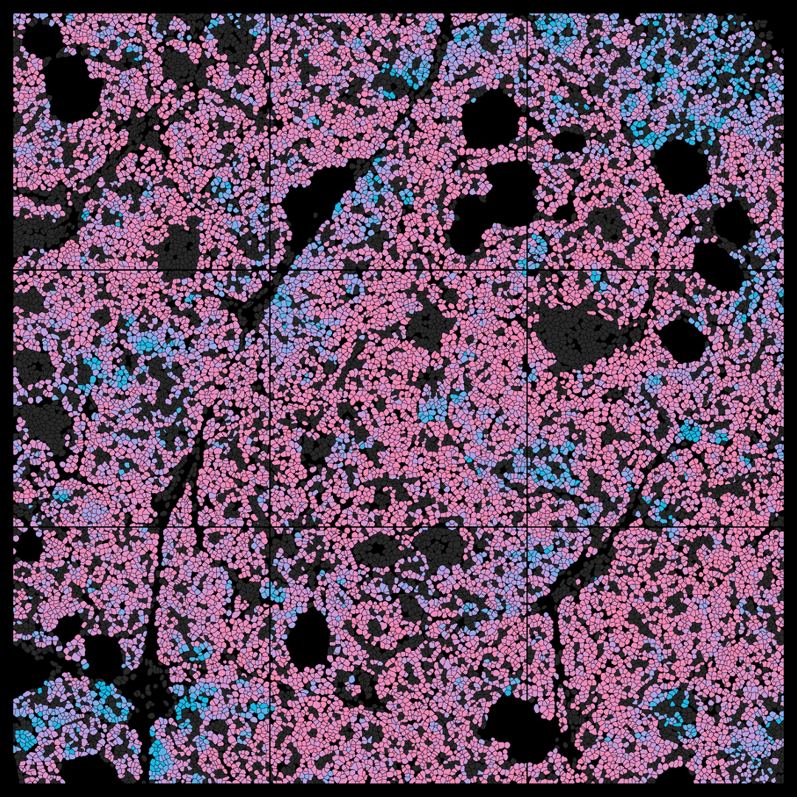

## Spatial gradients 
Trajectory analysis allows us to develop a lineage tree tracing one cell type to related types, but for spatial transcriptomic data sets, there is less need to measure branching differentiation, and it can make sense to just look at the differentiation between two types along a linear path. In this post, we do the following:
1. Identify markers for two cell types (acinar type 1 and 2)
2. Develop a rank-based score to visualize differentiation 

This takes off from the previous post "CosMx spatial domains". I also did this sort of rank-based score in my [thesis](https://escholarship.org/uc/item/3bf2h046) between TREM2+ "foamy" and SPP1+ "epithelioid" macrophages within the alveoli and granuloma core. Originally, when applying the pseudotime trajectories, a problem occurred where some outlier cells from the relevant cell types were significantly transcriptomically distinct, thus skewing the entire trajectory, so we opted for this simplified rank-based score. 

```python
from scipy.stats import rankdata
from scipy.ndimage import uniform_filter1d

import pandas.io.formats.excel
pandas.io.formats.excel.ExcelFormatter.header_style = None
```

## Finding markers
We already have our cell types, so we can investigate their markers first globally and then locally just for the two acinar subtypes using `rank_genes_groups`.


```python
# find global markers 
sc.tl.rank_genes_groups(adata, groupby="supervise", method="t-test", pts=True)

result = adata.uns["rank_genes_groups"]
groups = result["names"].dtype.names
# gene names 
genes_df = {group: result["names"][group] for group in groups}
# test statistic 
scores_df = {group: result["scores"][group] for group in groups}
# P-value
pv_df = {group: result["pvals_adj"][group] for group in groups}
# % fraction membership 
pts_df = {group: result["pts"][group] for group in groups}
pts_rest_df = {group: result["pts_rest"][group] for group in groups}
# FC 
fc_df = {group: result["logfoldchanges"][group] for group in groups}

maxlen = 0 
top_genes_df = {}

# create gene lists of significant hits, default sorting by P-value 
for clus in genes_df:
    genes = genes_df[clus]
    scores = scores_df[clus]
    # filter positive scores, significant P-values, remove negative probes 
    gene_idx = (scores_df[clus]>0) & (pv_df[clus]<0.05) & np.array([True if "SystemControl" not in x else False for x in genes]) & np.array([True if "Negative" not in x else False for x in genes])

    top_genes_df[clus] = genes[gene_idx]
    
    if maxlen < len(genes[gene_idx]):
        maxlen = len(genes[gene_idx])

# create data frames per cluster 
summary_df = {}
for domain in top_genes_df:
    gene_idx = np.where(np.isin(genes_df[domain],top_genes_df[domain]))[0]
    genes = top_genes_df[domain]
    scores = scores_df[domain][gene_idx]
    padj = pv_df[domain][gene_idx]
    pts = pts_df[domain].loc[genes].values * 100
    pts_rest = pts_rest_df[domain].loc[genes].values * 100
    fc = fc_df[domain][gene_idx]
    summary_df[domain] = pd.DataFrame([padj,fc,scores,pts,pts_rest],columns=genes,index=["padj","fc","score","%in","%out"]).T.sort_values(by="fc",ascending=False)

# padding gene lists to write to file 
for clus in genes_df:
    top_genes_df[clus]=list(top_genes_df[clus])+[np.nan for x in range(maxlen - len(top_genes_df[clus]))]
top_genes_df = pd.DataFrame(top_genes_df)

top_genes_df.rename(columns={x: inv_labels[int(x)] for x in top_genes_df.keys()},inplace=True)

with pd.ExcelWriter("pancreas_cell_type_markers.xlsx") as writer:
    top_genes_df.to_excel(writer, sheet_name="gene",index=False)
    for idx,x in enumerate(sorted(np.array(list(summary_df.keys())).astype(int))):
        summary_df[str(x)].to_excel(writer, sheet_name=list(top_genes_df.keys())[idx],index=True)
```

## Global markers 
Sometimes the global markers that differentiate types will contrast with the local markers between two types. For example, if you had two macrophage subpopulations, then globally, they might share macrophage markers as their key genes like CD68, but CD68 would be a poor gene to distinguish between the two subtypes. We have the following global markers for acinar cell types:
1. Acinar type 1: AMY1C, GP2, CELA2A, CLPS, CTRC
2. Acinar type 2: REG1B, REG3A, REG1A, REG3G, HSPB1

```python
pd.read_excel("pancreas_cell_type_markers.xlsx",sheet_name="gene").head()
```

<div class="nb-output">
<div>
<style scoped>
    .dataframe tbody tr th:only-of-type {
        vertical-align: middle;
    }

    .dataframe tbody tr th {
        vertical-align: top;
    }

    .dataframe thead th {
         text-align: center !important;
    }
</style>
<table border="1" class="dataframe">
  <thead>
    <tr style="text-align: center;">
      <th></th>
      <th>NA</th>
      <th>Acinar.1</th>
      <th>Acinar.2</th>
      <th>Active stellate</th>
      <th>Alpha cells</th>
      <th>Beta cells</th>
      <th>Delta cells</th>
      <th>Ductal</th>
      <th>Epsilon cells</th>
      <th>Gamma cells</th>
      <th>Macrophage</th>
      <th>Quiescent stellate</th>
    </tr>
  </thead>
  <tbody>
    <tr>
      <th>0</th>
      <td>CLEC4D</td>
      <td>AMY1C</td>
      <td>REG1B</td>
      <td>COL3A1</td>
      <td>GCG</td>
      <td>INS</td>
      <td>SST</td>
      <td>CARD8</td>
      <td>RANGAP1</td>
      <td>PPY</td>
      <td>CTSB</td>
      <td>HSPB1</td>
    </tr>
    <tr>
      <th>1</th>
      <td>FBLN1</td>
      <td>GP2</td>
      <td>REG3A</td>
      <td>COL1A1</td>
      <td>TTR</td>
      <td>CARD8</td>
      <td>INS</td>
      <td>CLU</td>
      <td>GHRL</td>
      <td>INS</td>
      <td>C1QC</td>
      <td>PLVAP</td>
    </tr>
    <tr>
      <th>2</th>
      <td>MGP</td>
      <td>CELA2A</td>
      <td>REG1A</td>
      <td>IGFBP7</td>
      <td>INS</td>
      <td>PCSK1N</td>
      <td>CARD8</td>
      <td>SPP1</td>
      <td>CLU</td>
      <td>CPE</td>
      <td>TMSB4X</td>
      <td>IGFBP7</td>
    </tr>
    <tr>
      <th>3</th>
      <td>NaN</td>
      <td>CLPS</td>
      <td>REG3G</td>
      <td>A2M</td>
      <td>PCSK1N</td>
      <td>CPE</td>
      <td>PCSK1N</td>
      <td>KRT8</td>
      <td>B2M</td>
      <td>TTR</td>
      <td>HLA-DRB1</td>
      <td>A2M</td>
    </tr>
    <tr>
      <th>4</th>
      <td>NaN</td>
      <td>CTRC</td>
      <td>HSPB1</td>
      <td>MGP</td>
      <td>CHGA</td>
      <td>GNAS</td>
      <td>TTR</td>
      <td>ATP1B1</td>
      <td>MPV17L</td>
      <td>PCSK1N</td>
      <td>FTL</td>
      <td>TGFBR2</td>
    </tr>
  </tbody>
</table>
</div>
</div>

```python
# find local markers 
sub_adata = adata[np.isin(adata.obs.supervise.values,[1,2]),:].copy()
sc.tl.rank_genes_groups(sub_adata, groupby="supervise", method='t-test', pts=True)

result = sub_adata.uns['rank_genes_groups']
groups = result['names'].dtype.names
genes_df = {group: result['names'][group] for group in groups}
scores_df = {group: result['scores'][group] for group in groups}
pv_df = {group: result['pvals_adj'][group] for group in groups}
pts_df = {group: result['pts'][group] for group in groups}
pts_rest_df = {group: result['pts_rest'][group] for group in groups}
fc_df = {group: result['logfoldchanges'][group] for group in groups}

maxlen = 0 
top_genes_df = {}

for clus in genes_df:
    genes = genes_df[clus]
    scores = scores_df[clus]
    gene_idx = (scores_df[clus]>0) & (pv_df[clus]<0.05) & np.array([True if "SystemControl" not in x else False for x in genes]) & np.array([True if "Negative" not in x else False for x in genes])

    top_genes_df[clus] = genes[gene_idx]
    
    if maxlen < len(genes[gene_idx]):
        maxlen = len(genes[gene_idx])

summary_df = {}
for domain in top_genes_df:
    gene_idx = np.where(np.isin(genes_df[domain],top_genes_df[domain]))[0]
    genes = top_genes_df[domain]
    scores = scores_df[domain][gene_idx]
    padj = pv_df[domain][gene_idx]
    pts = pts_df[domain].loc[genes].values * 100
    pts_rest = pts_rest_df[domain].loc[genes].values * 100
    fc = fc_df[domain][gene_idx]
    summary_df[domain] = pd.DataFrame([padj,fc,scores,pts,pts_rest],columns=genes,index=["padj","fc","score","%in","%out"]).T.sort_values(by='fc',ascending=False)
    
for clus in genes_df:
    top_genes_df[clus]=list(top_genes_df[clus])+[np.nan for x in range(maxlen - len(top_genes_df[clus]))]
top_genes_df = pd.DataFrame(top_genes_df)

top_genes_df.rename(columns={x: inv_labels[int(x)] for x in top_genes_df.keys()},inplace=True)

with pd.ExcelWriter('pancreas_acinar_markers.xlsx') as writer:
    top_genes_df.to_excel(writer, sheet_name='gene',index=False)
    for idx,x in enumerate(sorted(np.array(list(summary_df.keys())).astype(int))):
        summary_df[str(x)].to_excel(writer, sheet_name=list(top_genes_df.keys())[idx],index=True)
        
```

This data set is majority acinar type 1, so the gene lists do not change much when we just subset to acinar types and find the markers again.

```python
Counter(sup_ct["cell_types"])
```

```output
    Counter({'Acinar.1': 30423,
             'Ductal': 7348,
             'Acinar.2': 3574,
             'Quiescent stellate': 2699,
             'Beta cells': 1032,
             'Active stellate': 798,
             'Macrophage': 754,
             'Alpha cells': 494,
             'Delta cells': 107,
             'Gamma cells': 37,
             'Epsilon cells': 4})
```

```python
acinar_types = pd.read_excel("pancreas_acinar_markers.xlsx",sheet_name="gene").head(10)
acinar_types["Acinar.1"]
print(acinar_types)
```

```output
      Acinar.1  Acinar.2
    0    PRSS1     REG1B
    1     CPA1     REG3A
    2   CELA3B     HSPB1
    3    PNLIP     REG3G
    4     CPB1      SOD2
    5   CELA3A  SERPINA3
    6    AMY1C     C4B-2
    7     CLPS     CARD8
    8   CELA2A     CEBPD
    9   ZNF761     OLFM4
```

## Rank-based marker score 
Below, I have chosen some genes that are markers. Note that they may not be the absolute most significant, but their fold changes tend to be typically higher. 

```python
# key markers for acinar type 2  and type 1
genes_neg = ["SOD2","REG3A","SERPINA3","REG1B"]
genes_pos = ["PRSS1","FAM209B","CSTPP1","CLPS"]
```

When we pool some of the top genes by fold change and from our list, we can see from the cluster gene sheet that some of these genes are not very specific and are present in most cell types like REG1B; it is just more enriched in acinar type 2 but not turned off in acinar type 1. 

```python
pd.read_excel("pancreas_acinar_markers.xlsx",sheet_name="Acinar.2",index_col=0).loc[list(set(genes_neg+acinar_types["Acinar.2"].tolist()))]
```

<div class="nb-output">
<div>
<style scoped>
    .dataframe tbody tr th:only-of-type {
        vertical-align: middle;
    }

    .dataframe tbody tr th {
        vertical-align: top;
    }

    .dataframe thead th {
         text-align: center !important;
    }
</style>
<table border="1" class="dataframe">
  <thead>
    <tr style="text-align: center;">
      <th></th>
      <th>padj</th>
      <th>fc</th>
      <th>score</th>
      <th>%in</th>
      <th>%out</th>
    </tr>
  </thead>
  <tbody>
    <tr>
      <th>REG1B</th>
      <td>0.000000e+00</td>
      <td>1.474186</td>
      <td>88.254883</td>
      <td>99.860101</td>
      <td>99.329455</td>
    </tr>
    <tr>
      <th>HSPB1</th>
      <td>1.915355e-257</td>
      <td>1.733113</td>
      <td>36.947559</td>
      <td>76.580862</td>
      <td>55.444894</td>
    </tr>
    <tr>
      <th>CEBPD</th>
      <td>2.466916e-109</td>
      <td>1.551626</td>
      <td>23.200527</td>
      <td>38.080582</td>
      <td>19.574007</td>
    </tr>
    <tr>
      <th>C4B-2</th>
      <td>4.340879e-151</td>
      <td>1.955194</td>
      <td>27.616224</td>
      <td>38.696139</td>
      <td>16.066792</td>
    </tr>
    <tr>
      <th>OLFM4</th>
      <td>1.334245e-84</td>
      <td>2.579011</td>
      <td>20.309589</td>
      <td>17.375490</td>
      <td>4.812149</td>
    </tr>
    <tr>
      <th>SERPINA3</th>
      <td>2.123758e-169</td>
      <td>1.646065</td>
      <td>29.328682</td>
      <td>56.715165</td>
      <td>34.115636</td>
    </tr>
    <tr>
      <th>REG3G</th>
      <td>1.743825e-248</td>
      <td>1.576446</td>
      <td>36.108845</td>
      <td>82.792389</td>
      <td>64.661605</td>
    </tr>
    <tr>
      <th>CARD8</th>
      <td>5.135764e-126</td>
      <td>0.811158</td>
      <td>24.856857</td>
      <td>98.293229</td>
      <td>96.696578</td>
    </tr>
    <tr>
      <th>REG3A</th>
      <td>0.000000e+00</td>
      <td>4.192854</td>
      <td>82.324020</td>
      <td>89.983212</td>
      <td>53.686356</td>
    </tr>
    <tr>
      <th>SOD2</th>
      <td>3.458469e-202</td>
      <td>2.691203</td>
      <td>32.512642</td>
      <td>36.849468</td>
      <td>10.455905</td>
    </tr>
  </tbody>
</table>
</div>
</div>

Every cell gets a score derived from its rank position based on normalized expression (recall we did `normalize_total` and `log1p` in "Plotting CosMx FOVs"). If a cell is the highest expressing of some positive gene, then that gene's relative rank is `n/n`. If its expression of some other positive gene is the fifth highest, then this other gene's relative rank is `(n-4)/n`. We take the product of these ranks. 
1. Calculate relative rank of all positive genes
2. Take product of positive relative ranks
3. Calculate relative rank of negative genes
4. Take product of inverted negative relative ranks
5. Combine positive and negative scores and normalize 

```python
# product of scaled positive ranks 
expr_pos = sub_adata[:, genes_pos].X.toarray()
ranks_pos = np.apply_along_axis(rankdata, 0, expr_pos, method='average') / expr_pos.shape[0]
score_pos = np.prod(ranks_pos, axis=1)

# inversion of scaled negative ranks 
expr_neg = sub_adata[:, genes_neg].X.toarray()
ranks_neg = np.apply_along_axis(rankdata, 0, expr_neg, method='average') / expr_neg.shape[0]
score_neg = np.prod(1 - ranks_neg, axis=1)

# product of scores log-scaled, clipped, and min-max normalization 
combined_score = np.log(1E-20 + score_pos * score_neg)
q_low, q_high = np.percentile(combined_score, [1, 99]) 
clipped = np.clip(combined_score, q_low, q_high)
combined_score = (clipped - q_low) / (q_high - q_low)
order = np.argsort(combined_score)

sub_adata.obs["bin"] = combined_score
```

```python
# gene order in plot 
plot_genes = genes_pos+genes_neg[::-1]

# get expression data again 
X = sub_adata[:, plot_genes].X.toarray()
expr = X[order].T   

# Z-score, clipping, and smoothing expression data 
expr_z  = (expr - expr.mean(axis=1, keepdims=True)) / expr.std(axis=1, keepdims=True)
expr_z  = np.clip(expr_z, -3, 3)
expr_sm = uniform_filter1d(expr_z, size=50, axis=1)

# cluster colors 
cl_vals = sub_adata.obs['supervise'].astype(int).values
rgba = np.array([mpl.colors.to_rgba(hex_colors[c]) for c in cl_vals[order]])

n_rows = 2 + len(plot_genes)
row_height = 0.8

fig, axes = plt.subplots(
    n_rows, 1,
    figsize=(10, n_rows * row_height),
    sharex=True,
    gridspec_kw={"height_ratios": [1]*n_rows, "hspace": 0.02}
)
ax_bar_scores, ax_bar_cl, *ax_genes = axes

# combined score 
ax_bar_scores.imshow(combined_score[order][None, :], aspect='auto', cmap=cc.cm.CET_I3)
ax_bar_scores.set_yticks([]); ax_bar_scores.set_xticks([])
ax_bar_scores.set_ylabel('Score', rotation=0, labelpad=20, fontsize=20, ha='right')
ax_bar_scores.yaxis.set_label_coords(-0.01, 0.225)
for sp in ax_bar_scores.spines.values(): sp.set_visible(False)

# cluster bar 
ax_bar_cl.imshow(rgba[None,:,:], aspect='auto')
ax_bar_cl.set_yticks([]); ax_bar_cl.set_xticks([])
ax_bar_cl.set_ylabel('Cluster', rotation=0, labelpad=20, fontsize=20, ha='right')
ax_bar_cl.yaxis.set_label_coords(-0.01, 0.225)
for sp in ax_bar_cl.spines.values(): sp.set_visible(False)

# smoothed gene rows 
for ax, gene, row in zip(ax_genes, plot_genes, expr_sm):
    ax.imshow(row[None,:], aspect='auto', cmap='RdBu_r', vmin=-3, vmax=3, interpolation='nearest')
    ax.set_yticks([]); ax.set_xticks([])
    ax.set_ylabel(gene, rotation=0, labelpad=20, fontsize=20, ha='right')
    ax.yaxis.set_label_coords(-0.01, 0.225)
    for sp in ax.spines.values(): sp.set_visible(False)

plt.savefig("plots/pancreas_grdt_genes.png", dpi=400, bbox_inches="tight")
plt.close()
plt.clf()
```

We have the cells ordered by this score using these genes and then their respective cell types and the smoothed scaled expression. 



*Relative rank gradient score between acinar subtypes.*

```python
# distribution of scores 

custom_palette = {
    1: hex_colors[1],
    2: hex_colors[2]
}

plt.figure(figsize=(8, 4))
ax = sns.histplot(
    data=sub_adata.obs,
    x='bin',
    hue='supervise',
    hue_order=[1, 2],     
    palette=custom_palette,
    multiple='stack',
    edgecolor='black',
    alpha=0.8,
    legend=True
)

ax.set_xlabel('Acinar gene score', fontsize=20,labelpad=20)
ax.set_ylabel('Count', fontsize=20,labelpad=20)
ax.tick_params(axis='both', labelsize=16)

ax.set_title('')

leg = ax.legend_
leg.set_title('Category', prop={'size':16})
for text, new_label in zip(leg.texts, ['Type 1', 'Type 2']):
    text.set_text(new_label)
for text in leg.get_texts():
    text.set_fontsize(14)

frame = leg.get_frame()
frame.set_edgecolor('black')
frame.set_linewidth(2) 

sns.despine()
plt.tight_layout()

leg.set_bbox_to_anchor((1.0, 1.1), transform=ax.transAxes)
plt.savefig("plots/pancreas_grdt_dist.png", dpi=400, bbox_inches="tight")
plt.close()
plt.clf()
```

As we can observe, acinar type 2 scores are quite low whereas acinar type 1 scores follow a high truncated normal distribution. 



*Distribution of gradient scores between subtypes.*

As we showed before, to plot a gradient over the cells, you need to digitize the score and then index a color map.


```python
dpt = sub_adata.obs["bin"]

# 255 bins 
bin_edges = np.linspace(dpt.min(), dpt.max(), 255)

adata.obs['bin'] = 0
adata.obs.loc[sub_adata.obs.index, 'bin'] = np.digitize(dpt, bin_edges)
#adata.obs["bin"] = adata.obs["bin"].astype("category")

# get digitized colors from colorcet cmap 
cmap = cc.cm.CET_I3  
dpt_colors = [mpl.colors.to_hex(cmap(i / 254)) for i in range(255)]
dpt_colors = ['#A6A6A6'] + dpt_colors
```

```python
# plot gradient 
plot_domains(
    adata=adata,
    marker_key = "bin",
    hex_colors=dpt_colors,
    fovs=np.array(list(range(51,60))).astype(str),
    filename=f"plots/grdt_acinar.png",
    figsize = (16,16),
    dpi=400,
    apply_erosion=1,
    inv_labels=inv_labels,
    plot_legend=False,
    alpha_key="supervise",
    alpha_vals=[1,2],
)

# plot cell type 
plot_domains(
    adata=adata,
    marker_key = "supervise",
    hex_colors=hex_colors,
    fovs=np.array(list(range(51,60))).astype(str),
    filename=f"plots/ct_acinar.png",
    figsize = (16,16),
    dpi=400,
    apply_erosion=1,
    inv_labels=inv_labels,
    plot_legend=False,
    alpha_key="supervise",
    alpha_vals=[1,2],
)
```

And so we get nice blue to red gradients around where the acinar type 2 cells localize. 

As a funny aside, I found a typo in my thesis. Previously, I had 256 bins, but cells with the max value 256 were being scaled as grey, instead of red. This is because in `plot_domains`, we had the line:

```python
matrix = np.array(get_mm(segmentation_map, leiden_clusters), dtype=np.uint8)
```

But`np.uint8` has 8-bit precision, so 255 is the max value and 256 maps back to 0. 



*Spatial gradients mapped to acinar subtypes.*

