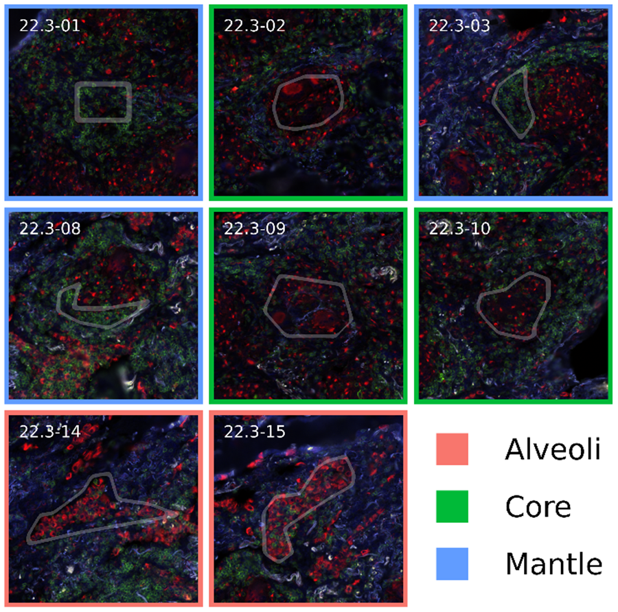
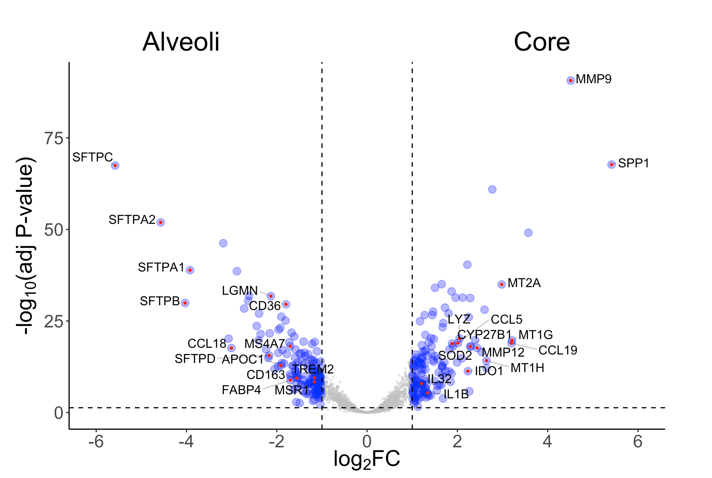
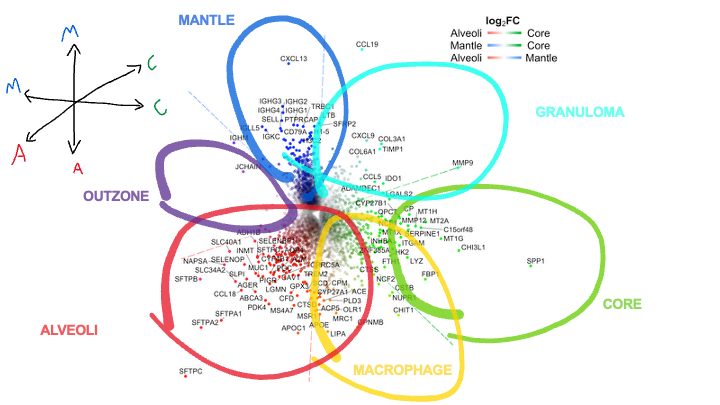

## Overview 

Over the course of my PhD, I was supervised by [Matteo Pellegrini](https://www.pellegrini.mcdb.ucla.edu/) and worked closely with [Robert Modlin](https://labs.dgsom.ucla.edu/modlin/pages/), a second supervisor in all but name. I was tasked with analyzing GeoMx and CosMx data for pulmonary tuberculosis samples provided by Chaouki Ben Abessalem. All of my analyses were for projects funded by Robert. Currently, the PhD is [embargoed](https://escholarship.org/uc/item/3bf2h046) and will remain this way for about a year. A few minor contributions are present in a [preprint](https://www.biorxiv.org/content/10.1101/2025.07.15.664002v3.abstract), while the rest remains unpublished.

Here I will go through one contribution without revealing any biological data not currently public or not likely to be published in the next manuscript. 

## GeoMx data

GeoMx is like bulk RNA-seq except an experimentalist will have selected specific regions of the tissue to probe. NanoString (Bruker) provides coordinates, nuclei counts, sequencing read statistics, and morphology protein channel files. Every spot will contain 100-1k cells with gene measurements in aggregate. We sampled spots from the alveoli inflamed with pneumonitis and the granuloma core and mantle regions. 



*Sample GeoMx spots from [suplementary figure 2](https://www.biorxiv.org/content/10.1101/2025.07.15.664002v3.supplementary-material).*

## 3D volcano   

When you have bulk RNA-seq for multiple treatment types, often we want to test whether specific genes are differentially expressed under some treatment condition (AvB). Using tools like DESeq2, one can get a fold change of the average enrichment between groups and the significance of that effect. These are visualized in a 2D volcano plot with fold change on the X-axis and P-value significance on the Y-axis. 



*Sample volcano plot from [suplementary figure 3](https://www.biorxiv.org/content/10.1101/2025.07.15.664002v3.supplementary-material) with FC on X-axis and P-value on Y-axis.*

Instead of just contrasting two groups, how do we contrast three (AvBvC)? Well, one can plot the pairwise fold change contrasts for each gene. Because the third contrast AvC is not independent from AvB and BvC, these fold changes will create a plane that can be projected back into 2D space. This produces one plot that carries the fold change information typically required in three 2D volcano plots. 



*3D volcano plot with annotations [figure 2.3](https://escholarship.org/uc/item/3bf2h046).*

The genes enriched in between contrasts AvC and AvB are the A genes, and the genes enriched between AvC and BvC are the ~C genes. Both sets constitute gene modules as highlighted by the annotations. These genes are mapped to colors, and in the thesis, we demonstrated that plotting transcripts from the CosMx gene panel with those colors captures the infected lung tissue structure without relying on segmentation (the core was green, the mantle was blue, and the inner layer of the granuloma was cyan). 

## Code
Mapping fold change to 3D space and transforming 3D plane back into 2D. Note that we had to choose two genes on opposite ends of the plane to get a good projection. We converted genes in [RGB to hex colors](https://drive.google.com/file/d/1fTnh9-Va414HWgF7B67snyeMQ7Qm7wR1/view?usp=sharing). 
<pre>
```R
  # merge CvA, MvA, flipped MvC 
df<-bind_cols(as.data.frame(res_ca),as.data.frame(res_ma),as.data.frame(res_mc))
df$`log2FoldChange...14`<- -as.numeric(df$`log2FoldChange...14`)
df$`log2FoldChange...2`<- as.numeric(df$`log2FoldChange...2`)
df$`log2FoldChange...8`<- as.numeric(df$`log2FoldChange...8`)

df$gene <- rownames(df)

# L2 norm for two selected genes 
vector1 <- df["SPP1",c("log2FoldChange...2","log2FoldChange...8","log2FoldChange...14")]
vector2 <- df["CXCL13",c("log2FoldChange...2","log2FoldChange...8","log2FoldChange...14")]
vector1 <- vector1 / sqrt(sum(vector1^2))
vector2 <- vector2 / sqrt(sum(vector2^2))
vector1<-as.numeric(vector1)
vector2<-as.numeric(vector2)

# Construct the transformation matrix
transformation_matrix <- cbind(as.vector(unname(vector1)), as.vector(unname(vector2)))
coords_3d <- as.matrix(df[, c("log2FoldChange...2", "log2FoldChange...8", "log2FoldChange...14")])
coords_2d <- coords_3d %*% transformation_matrix
coords_2d <- as.data.frame(coords_2d)
colnames(coords_2d) <- c("x","y")

# green is CvA and CvM 
green <- coords_3d[,c("log2FoldChange...2","log2FoldChange...14")]
# blue is MvA, MvC (flipped back)
blue <- coords_3d[,c("log2FoldChange...8","log2FoldChange...14")]
blue[,2] <- -blue[,2]
# red is AvC and AvM (both flipped)
red <- -coords_3d[,c("log2FoldChange...2","log2FoldChange...8")]

# clip between 0-3 and normalize 
red[red<0]<-0
blue[blue<0]<-0
green[green<0]<-0

red <- rowSums(red)
red[red>3] <- 3
red <- (red - min(red))/(max(red)-min(red))
blue <- rowSums(blue)
blue[blue>3] <- 3
blue <- (blue - min(blue))/(max(blue)-min(blue))
green <- rowSums(green)
green[green>3] <- 3
green <- (green - min(green))/(max(green)-min(green))

df_color <- round(data.frame(red,green,blue),digits=2)
alphas <- apply(df_color,1,max)^2

colnames(df_color) <- c("red","green","yellow") 

# map from rgb to hex for 0.01 increments 
cmap_hash <- read.table("data/cmap_dict.csv",sep=",",row.names = 1)

df_color <- paste0(df_color$red,"_",df_color$green,"_",df_color$yellow)
df_color <-  cmap_hash[df_color,]
df_color <- unlist(df_color)

coords_2d$color <- df_color
coords_2d$alpha <- alphas
coords_2d$Gene <- rownames(coords_2d)
uniq_color <- unique(df_color)  
</pre>


Constructing axes for plot using same transformation. 
<pre>
```R
axis_cf <- c(1, 0, 0)  
axis_mf <- c(0, 1, 0)  
axis_mc <- c(0, 0, 1)  

# Apply the transformation matrix to these axes
transformed_axis_cf <- t(as.matrix(axis_cf)) %*% transformation_matrix
transformed_axis_mf <- t(as.matrix(axis_mf)) %*% transformation_matrix
transformed_axis_mc <- t(as.matrix(axis_mc)) %*% transformation_matrix

# Extend the transformed axes to the plot boundaries
# This can be tricky, you might need to find the points on these lines that intersect your plot boundaries
# For simplicity, let's extend them by a fixed factor for now
x_limits <- range(coords_2d$x)
y_limits <- range(coords_2d$y)

color_transition_cf <- colorRampPalette(c("#F8766D", "white", "#00BA38"))
color_transition_mc <- colorRampPalette(c("#619CFF", "white", "#00BA38"))
color_transition_mf <- colorRampPalette(c("#F8766D", "white", "#619CFF"))

extend_factor <- 6.5
num_points <- 30 

axis_points <- seq(-extend_factor, extend_factor, length.out = num_points)

gradient_colors <- color_transition_cf(num_points)
axis_cf_df <- data.frame(x = axis_points * transformed_axis_cf[1], 
                         y = axis_points * transformed_axis_cf[2],
                         col = gradient_colors)

gradient_colors <- color_transition_mc(num_points)
axis_mc_df <- data.frame(x = axis_points * transformed_axis_mc[1], 
                         y = axis_points * transformed_axis_mc[2],
                         col = gradient_colors)

gradient_colors <- color_transition_mf(num_points)
axis_mf_df <- data.frame(x = axis_points * transformed_axis_mf[1], 
                         y = axis_points * transformed_axis_mf[2],
                         col = gradient_colors)
</pre>

Plotting and labeling most significantly enriched genes. 
<pre>
```R
g <- ggplot(coords_2d, aes(x=x, y=y, color=color, alpha=alpha))
g <- g + geom_segment(data = axis_cf_df,
                      aes(x = x, y = y,
                          xend = c(lead(x)[1:num_points-1],diff(lead(x))[1]+lead(x)[num_points-1]),
                          yend = c(lead(y)[1:num_points-1],diff(lead(y))[1]+lead(y)[num_points-1]), col = col),
                      show.legend = FALSE,alpha=1,linetype="longdash") +
  geom_segment(data = axis_mc_df,
               aes(x = x, y = y,
                   xend = c(lead(x)[1:num_points-1],diff(lead(x))[1]+lead(x)[num_points-1]),
                   yend = c(lead(y)[1:num_points-1],diff(lead(y))[1]+lead(y)[num_points-1]), col = col),
               show.legend = FALSE,alpha=1,linetype="longdash") +
  geom_segment(data = axis_mf_df,
               aes(x = x, y = y,
                   xend = c(lead(x)[1:num_points-1],diff(lead(x))[1]+lead(x)[num_points-1]),
                   yend = c(lead(y)[1:num_points-1],diff(lead(y))[1]+lead(y)[num_points-1]), col = col),
               show.legend = FALSE,alpha=1,linetype="longdash")
g <- g +
  geom_point(aes(alpha=alpha)) + 
  scale_color_identity() + 
  scale_alpha_identity() + 
  theme_classic() +
  theme(
    legend.position = "none",
    panel.background = element_rect(fill = "white"),  # Black background
    text = element_text(color = "black",size=20),             # White text
    axis.title = element_text(color = "black"),       # White axis titles
    axis.text = element_text(color = "black"),
    panel.border=element_blank(),
    panel.grid.major=element_blank(),
    panel.grid.minor=element_blank(),
    axis.line=element_blank(),
    axis.text.x=element_blank(),
    axis.text.y=element_blank(),
    axis.ticks=element_blank(),
    axis.title.x=element_blank(),
    axis.title.y=element_blank(),
    # White axis text
  )

# display 100 most distance genes ~1.93
g <- g + geom_text_repel(
  data = subset(coords_2d, (rowSums(abs(coords_3d) > 2) > 0) | (rowSums(abs(coords_3d) > 1.75) > 1)),
  aes(label = Gene),
  size = 4,
  alpha = 1,
  point.padding = 0.2,
  color = "black",
  min.segment.length = 0.2,
  box.padding = 0.2,
  max.overlaps = Inf,
  nudge_x = 0.1,
  nudge_y = 0.1,
  segment.alpha = 0.5
)

legend_y_start <- max(coords_2d$y) * 1.1
legend_x_start <- max(coords_2d$x) * 0.8

color_transition_cf <- colorRampPalette(c("#F8766D", "white", "#00BA38"))
color_transition_mc <- colorRampPalette(c("#619CFF", "white", "#00BA38"))
color_transition_mf <- colorRampPalette(c("#F8766D", "white", "#619CFF"))

# Adjusting the coordinates for the CF (Core vs. Alveoli) gradient
axis_cf_df_legend <- axis_cf_df
axis_cf_df_legend$y <- legend_y_start
axis_cf_df_legend$x <- legend_x_start + (axis_cf_df_legend$x - min(axis_cf_df_legend$x)) / (max(axis_cf_df_legend$x) - min(axis_cf_df_legend$x)) * max(coords_2d$x) * 0.15
axis_cf_df_legend$col <- color_transition_cf(num_points)

# Apply similar adjustments for the MC (Mantle vs. Core) and MF (Mantle vs. Alveoli) gradients
# Adjusting the MC gradient
axis_mc_df_legend <- axis_mc_df
axis_mc_df_legend$y <- legend_y_start - 0.075 * max(coords_2d$y)  # Adjust Y to position below CF
axis_mc_df_legend$x <- legend_x_start + (axis_mc_df_legend$x - min(axis_mc_df_legend$x)) / (max(axis_mc_df_legend$x) - min(axis_mc_df_legend$x)) * max(coords_2d$x) * 0.15
axis_mc_df_legend$col <- color_transition_mc(num_points)

# Adjusting the MF gradient
axis_mf_df_legend <- axis_mf_df
axis_mf_df_legend$y <- legend_y_start - 0.15 * max(coords_2d$y)  # Adjust Y to position below MC
axis_mf_df_legend$x <- legend_x_start + (axis_mf_df_legend$x - min(axis_mf_df_legend$x)) / (max(axis_mf_df_legend$x) - min(axis_mf_df_legend$x)) * max(coords_2d$x) * 0.15
axis_mf_df_legend$col <- color_transition_mf(num_points)

g <- g + geom_segment(data = axis_cf_df_legend,
                      aes(x = x-0.01, y = y,
                          xend = c(lead(x)[1:num_points-1], diff(lead(x))[1] + lead(x)[num_points-1])+0.01,
                          yend = y, col = col),
                      show.legend = FALSE, alpha = 1, linetype = "solid",linewidth=2) +
  geom_text(data = data.frame(x = c(min(axis_cf_df_legend$x)-0.75, max(axis_cf_df_legend$x)+0.65),
                              y = c(min(axis_cf_df_legend$y), min(axis_cf_df_legend$y)),
                              label = c("Alveoli", "Core")),
            aes(x = x, y = y, label = label),
            size = 6, color = "black", alpha=1) +
  geom_segment(data = axis_mc_df_legend,
               aes(x = x-0.01, y = y,
                   xend = c(lead(x)[1:num_points-1], diff(lead(x))[1] + lead(x)[num_points-1])+0.01,
                   yend = y, col = col),
               show.legend = FALSE, alpha = 1, linetype = "solid",linewidth=2) +
  geom_text(data = data.frame(x = c(min(axis_mc_df_legend$x)-0.75, max(axis_mc_df_legend$x)+0.65),
                              y = c(min(axis_mc_df_legend$y), min(axis_mc_df_legend$y)),
                              label = c("Mantle", "Core")),
            aes(x = x, y = y, label = label),
            size = 6, color = "black", alpha=1) +
  geom_segment(data = axis_mf_df_legend,
               aes(x = x-0.01, y = y,
                   xend = c(lead(x)[1:num_points-1], diff(lead(x))[1] + lead(x)[num_points-1])+0.01,
                   yend = y, col = col),
               show.legend = FALSE, alpha = 1, linetype = "solid",linewidth=2) +
  geom_text(data = data.frame(x = c(min(axis_mf_df_legend$x)-0.75, max(axis_mf_df_legend$x)+0.75),
                              y = c(min(axis_mf_df_legend$y), min(axis_mf_df_legend$y)),
                              label = c("Alveoli", "Mantle")),
            aes(x = x, y = y, label = label),
            size = 6, color = "black", alpha=1)

g <- g+annotate("text", x = min(axis_cf_df_legend$x)+0.525, y = min(axis_cf_df_legend$y)+0.35, 
                label = expression(bold(log[2] * "FC")), 
                size = 6, color = "black", alpha = 1, fontface = "bold", parse = TRUE)

ggsave(file = "plots/manuscript/3DVolc.png", plot = g, device = "png", width=9,height=9, dpi = 400)
</pre>
